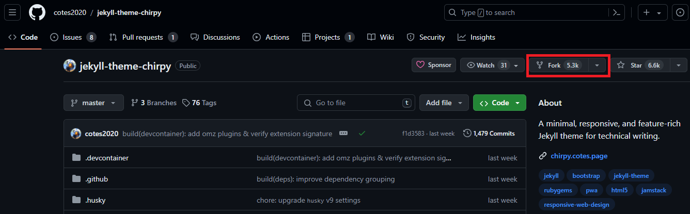
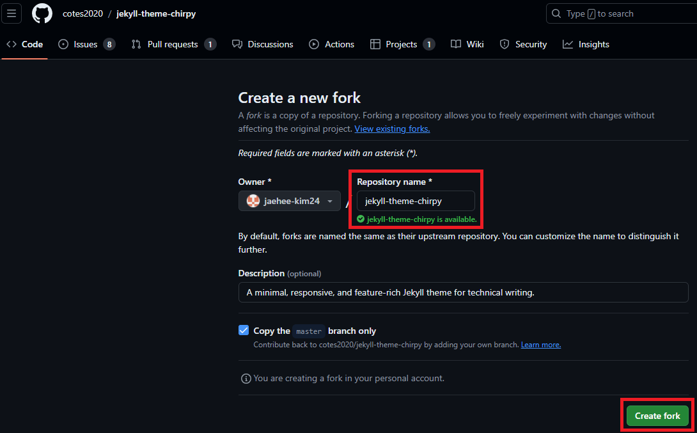
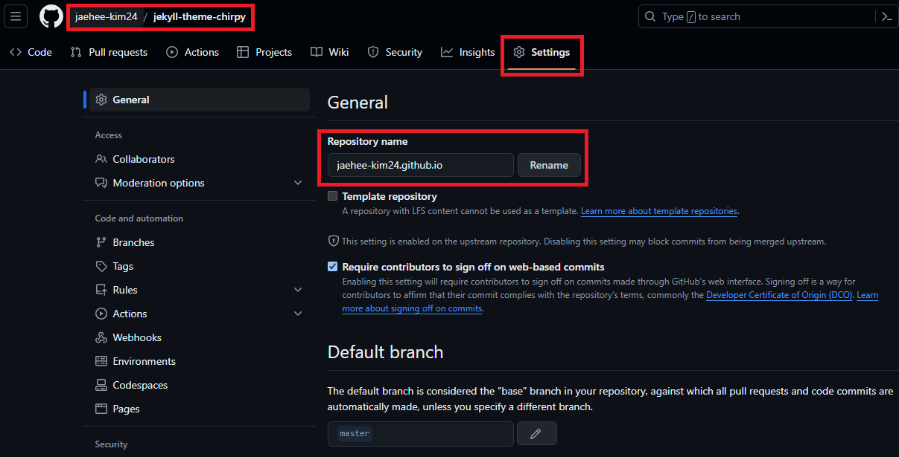
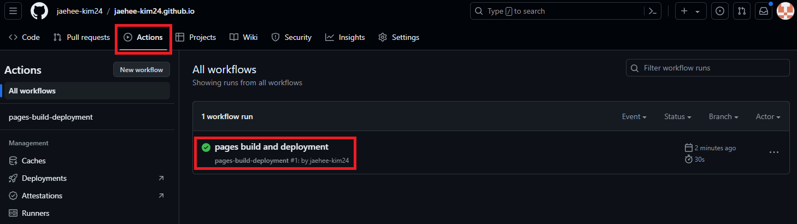
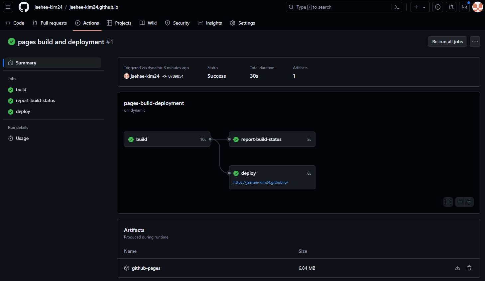
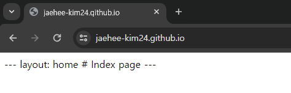

>안녕하세요 재히입니다 o((>ω< ))o  
그동안 미뤄왔던 블로그를 어디서 시작하면 좋을지 고민하다, github 블로그를 개설하기로 결정했습니다!!! (🎉우와 짝짝짝🎊🎉)  

현재 포스팅에서는 보고계시는 이 블로그의 개설 과정과 커스텀 과정을 기록하려고 합니다.  
저는 Window 환경에서 GitHub Desktop, Visual Studio Code를 사용합니다.

연관 포스팅  
- [Jekyll Chirpy 테마 Github 블로그 개설하기(2024.06 기준)-2](https://jaehee-kim24.github.io/posts/github%EB%B8%94%EB%A1%9C%EA%B7%B8_%EA%B0%9C%EC%84%A4%ED%95%98%EA%B8%B0_2/)
- [Jekyll Chirpy 테마 Github 블로그 꾸미기](https://jaehee-kim24.github.io/posts/github%EB%B8%94%EB%A1%9C%EA%B7%B8_%EA%BE%B8%EB%AF%B8%EA%B8%B0/)

# Github Blog
[Github](https://github.com/ "Github 링크")는 [Git](https://www.git-scm.com/ "Git 링크")을 호스팅하는 웹 페이지입니다. 본 포스팅은 Git과 Github에 대해 익숙하지 않으신분들도 따라하실 수 있도록 기록했지만, 기본적인 내용을 알고 있으면 좋으니 관련 글이나 홈페이지에서 정보를 확인 해주세요.  
Github blog를 시작하기 위해서는 Github 계정이 필요합니다.  
시작 전 [Github](https://github.com/ "Github 링크")로 접속하여 계정생성을 진행해주세요. 계정 생성과정은 어렵지 않으며, 자료가 많기 때문에 생략하겠습니다. 추후 필요시 내용을 추가하겠습니다.

# Jekyll 테마 사용하여 블로그 개설하기

## 1. Jekyll

### Jekyll(지킬) 이란?
Jekyll은 정적 사이트 생성기(Static site generator)로 Markdown, HTML, CSS, 그리고 기타 템플릿 언어를 사용하여 정적 웹사이트를 생성하는 도구입니다.  
#### 주요특징
[Jekyll](https://jekyllrb-ko.github.io/ "Jekyll 링크") 사이트에 방문해보세요. 그들이 말하는 특징은 크게 3가지 입니다.
> 1. 심플함
> 2. 정적
> 3. 블로그 지향적  

지금은 다 이해하지 않아도 됩니다. 곧 다 알게 될테니까요.  

## 2. Jekyll Themes 선택

### Jekyll Themes 사이트
지금 여러분이 가장 먼저 해야할 일은 Jekyll 페이지의 [RESOURCES](https://jekyllrb-ko.github.io/resources/) 탭을 눌러서 테마를 구경하는 겁니다.  
사이트에는 3곳의 링크가 있는데요. 아래에 링크 걸어두겠습니다.
> - [jamstackthemes.dev](https://jamstackthemes.dev/ssg/jekyll/)
> - [jekyllthemes.org](http://jekyllthemes.org/)
> - [jekyllthemes.io](https://jekyllthemes.io/)

Demo를 눌러서 어떤게 여러분의 취향에 맞는지 확인하고 선택해보세요!  
테마가 너무 많아서 저는 여기서 시간을 가장 오래 잡아먹었네요. 저는 이 중 첫번째 사이트에서 [Chirpy](https://jamstackthemes.dev/demo/theme/jekyll-theme-chirpy/ "Chirpy Demo") 테마를 골랐어요.  
정답은 없으니 여러분들의 기준으로 선택하시면 됩니다.  
저는 아래와 같은 조건에 부합하는 테마 중 Chirpy를 선택했어요.  
~~_(알고보니 이 테마를 사용하시는 분들이 많아서 정보 얻기가 쉬웠다 오예 댕이득~)_~~  
- 카테고리는 계층별로
- 오른쪽 사이드 바에 Contents
- 왼쪽 사이드 바에 간단한 정보 
- 게시글 검색 기능
- 깔끔한 디자인 선호

## 3. 선택한 테마 Fork
각자가 선택한 테마의 Github에 들어가서 fork를 해올 건데요. 저는 [Chirpy](https://github.com/cotes2020/jekyll-theme-chirpy/ "Chirpy Github")를 fork 해보겠습니다.  
### fork
  
> fork 클릭  

  
> 이름 그대로 두고, Create fork  

## 4. 배포를 위한 Setting
위와 같이 진행하면 여러분의 Github에 fork한 Repository가 생성됩니다.  

### Repository 이름 변경
  
>  Settings 탭에 들어가서 Repositoy 이름 변경

Github blog를 열기 위해서는 Repository 이름은 **_[githubID]_.github.io**로 설정해야합니다.  
따라서 저는 "jaehee-kim24.github.io"로 바꿔주었습니다. 여러분의 github 아이디를 넣어서 작성해주세요.    
Rename 버튼을 누르면, 잠시 뒤 여러분의 Repository의 이름이 변경 된 것을 볼 수 있습니다.  

### Build and deployment 변경
  
>  Build and deployment를 Github Actions로 변경  

마찬가지로 Settings 탭에 들어가셔서 왼쪽 사이드바의 Pages를 선택해주세요.  
Build and deployment를 Github Actions로 바꾸고, 새로고침 하면 여러분의 블로그 주소가 GitHub Pages 아래쪽에 나타납니다.  
저는 https://jaehee-kim24.github.io/ 라고 보이네요.  

### Workflow 확인하기
  
>  Actions 탭에서 build와 deploy 확인 가능

Actions 탭에 들어가면 현재 build와 deploy 과정을 볼 수 있습니다. 첫 번째 workflow가 생겼죠? 눌러볼까요?  

  
>  Workflow 확인

이렇게 build와 deploy에 걸린 시간과 성공 실패 여부까지 확인 할 수 있습니다.  

## 5. 블로그 접속
deploy에 성공했다면 여러분의 블로그에 접속 할 수 있습니다. Workflow에서 deploy 아래에 보이는 링크로 들어가보세요. 혹은 Settings 탭의 pages에서도 링크 확인 가능합니다.  
이제 드디어! 두근거리는 마음으로 첫 번째 배포한 블로그에 들어가 볼까요?  

  
>  블로그 접속

`---layout: home # Index pagee ---`  
┌( ಠ_ಠ)┘ 읭?! 아까 내가 선택한 테마는 이게 아닌데... 싶으실겁니다ㅎㅎㅎ  
그래도!! 여기까지 따라오셨다면 일단 축하드립니다!! 우선 블로그를 개설(이라고 하긴 좀 그렇고 반쯤...?)에 성공한 상태랍니다.  
그럼 뒷 포스팅에서 연결하여 테마 적용까지 해보겠습니다. 계속 따라와주세요!

연관 포스팅  
- [Jekyll Chirpy 테마 Github 블로그 개설하기(2024.06 기준)-2](https://jaehee-kim24.github.io/posts/github%EB%B8%94%EB%A1%9C%EA%B7%B8_%EA%B0%9C%EC%84%A4%ED%95%98%EA%B8%B0_2/)
- [Jekyll Chirpy 테마 Github 블로그 꾸미기](https://jaehee-kim24.github.io/posts/github%EB%B8%94%EB%A1%9C%EA%B7%B8_%EA%BE%B8%EB%AF%B8%EA%B8%B0/)