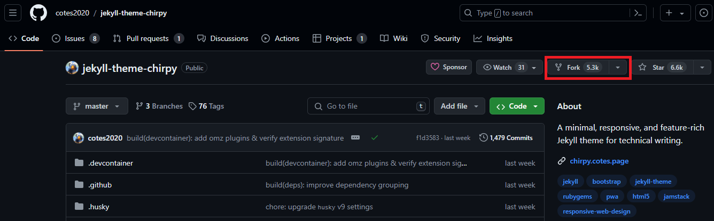
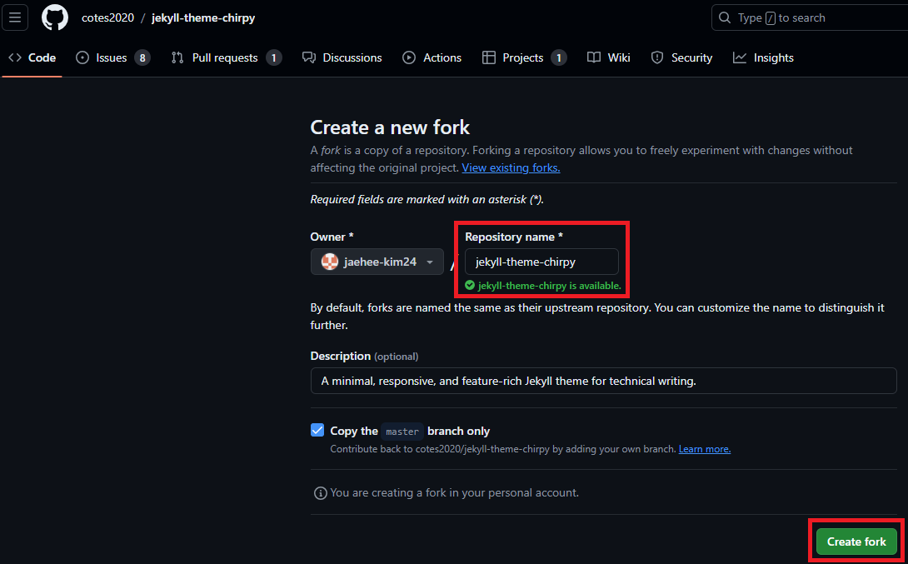
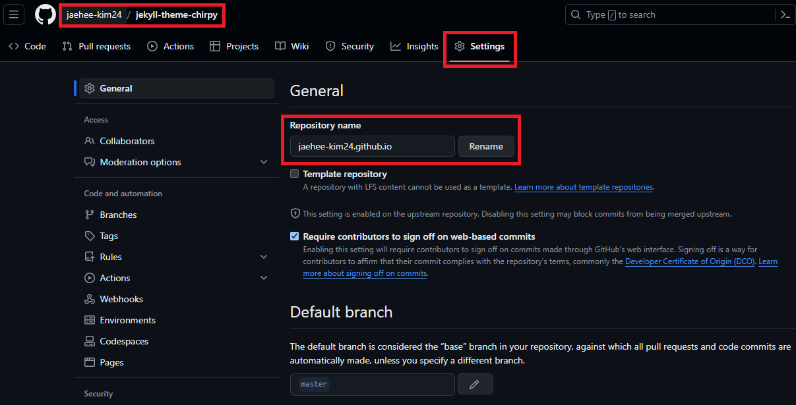
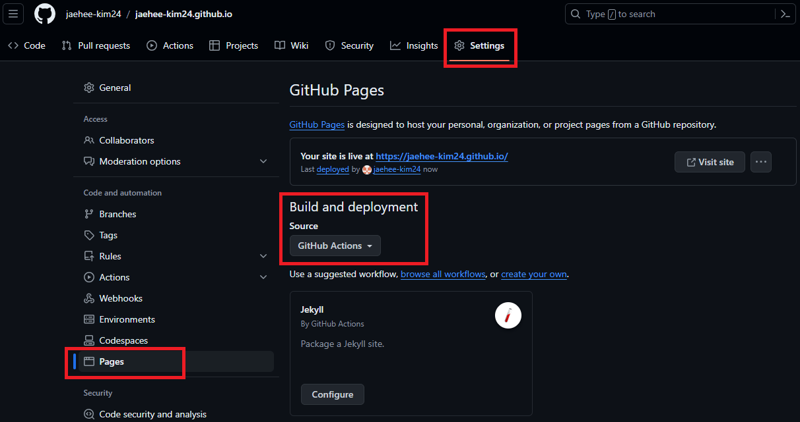
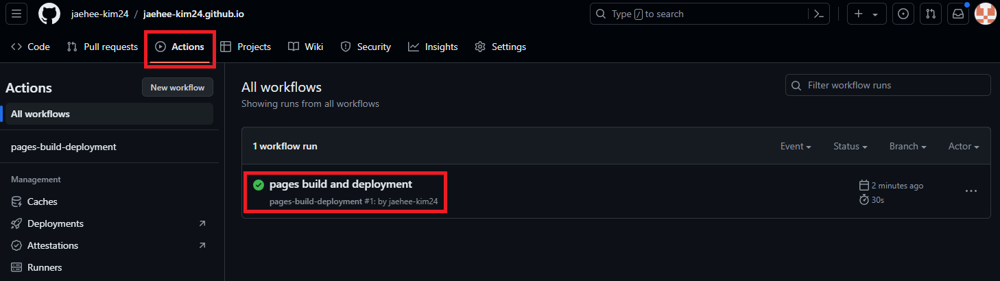
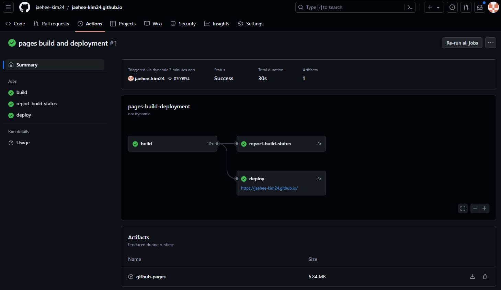

>안녕하세요 재히입니다.  
그동안 미뤄왔던 블로그를 어디서 시작하면 좋을지 고민하다, github 블로그를 개설하기로 결정했습니다!!!(우와~ 짝짝짝)  
지금부터 보고계시는 이 블로그의 개설 과정과 커스텀 과정을 기록하려고 합니다.  
저는 Window 환경에서 github desktop, vscode를 사용합니다.

## Github Blog
[Github](https://github.com/ "Github 링크")는 [Git](https://www.git-scm.com/ "Git 링크")을 호스팅하는 웹 페이지입니다. Git과 Github에 대해 익숙하지 않으신분들도 따라하실 수 있지만, 기본적인 내용을 알고 있으면 좋으니, 관련 글이나 홈페이지 정보를 확인 해주세요.  
Github blog를 시작하기 위해서는 Github 계정이 필요합니다.  
시작 전 [Github](https://github.com/ "Github 링크")로 접속하여 계정생성을 진행해주세요. 계정 생성과정은 어렵지 않으며, 자료가 많기 때문에 생략하겠습니다. 추후 필요시 내용을 추가하겠습니다.

## Jekyll 테마 사용하여 블로그 개설하기

### Jekyll(지킬) 이란?
Jekyll은 정적 사이트 생성기(Static site generator)로 Markdown, HTML, CSS, 그리고 기타 템플릿 언어를 사용하여 정적 웹사이트를 생성하는 도구입니다.  
### 주요특징
[Jekyll](https://jekyllrb-ko.github.io/ "Jekyll 링크") 사이트에 방문해보세요. 그들이 말하는 특징은 크게 3가지 입니다.
> 1. 심플함
> 2. 정적
> 3. 블로그 지향적  

### Jekyll Themes 선택하기
지금은 다 이해하지 않아도 됩니다. 곧 다 알게 될테니까요.  
지금 여러분이 가장 먼저 해야할 일은 Jekyll 페이지의 [RESOURCES](https://jekyllrb-ko.github.io/resources/) 탭을 눌러서 테마를 구경하는 겁니다.  
사이트에는 3곳의 링크가 있는데요. 아래에 링크 걸어두겠습니다.
> - [jamstackthemes.dev](https://jamstackthemes.dev/ssg/jekyll/)
> - [jekyllthemes.org](http://jekyllthemes.org/)
> - [jekyllthemes.io](https://jekyllthemes.io/)

Demo를 눌러서 어떤게 여러분의 취향에 맞는지 확인하고 선택해보세요! 테마가 너무 많아서 저는 여기서 시간을 가장 오래 잡아먹었네요. 저는 이 중 첫번째 사이트에서 [Chirpy](https://jamstackthemes.dev/demo/theme/jekyll-theme-chirpy/ "Chirpy Demo") 테마를 골랐어요.~~_(알고보니 이 테마를 사용하시는 분들이 많아서 정보 얻기가 쉬웠다 오예 댕이득~)_~~  

### 선택한 테마 Fork 해오기
각자가 선택한 테마의 Github에 들어가서 fork를 해올 건데요. 저는 [Chirpy](https://github.com/cotes2020/jekyll-theme-chirpy/ "Chirpy Github")를 fork 해보겠습니다.  
#### fork
  
> fork 클릭  

  
> 이름 그대로 두고, Create fork  

#### 블로그 접속해보기
위와 같이 진행하면 여러분의 Github에 fork한 Repository가 생성됩니다.  

  
>  Settings 탭에 들어가서 Repositoy 이름 변경

Github blog를 열기 위해서는 Repository 이름은 **_githubID_.github.io** 로 설정해야합니다. 따라서 저는 "jaehee-kim24.github.io"로 바꿔주었습니다. 여러분의 github 아이디를 넣어서 작성해주세요.    
Rename 버튼을 누르면, 잠시 뒤 여러분의 Repository의 이름이 변경 된 것을 볼 수 있습니다.  

  
>  Build and deployment 변경  

마찬가지로 Settings 탭에 들어가셔서 왼쪽 사이드바의 Pages를 선택해주세요.  
Build and deployment를 Github Actions로 바꾸고, 새로고침 하면 여러분의 블로그 주소가 GitHub Pages 아래쪽에 나타납니다.  
저는 https://jaehee-kim24.github.io/ 라고 보이네요.  

  
>  Actions에서 build와 deploy 확인 가능

Actions 탭에 들어가면 현재 build와 deploy 과정을 볼 수 있습니다. 첫 번째 workflow가 생겼죠? 눌러볼까요?  

  
>  Workflow 확인

이렇게 build와 deploy에 걸린 시간과 성공 실패 여부까지 확인 할 수 있습니다.  
이제 드디어! 두근거리는 마음으로 첫 번째 배포한 블로그에 들어가 볼까요?  

  
>  블로그 접속

음... 아까 내가 선택한 테마는 이게 아닌데... 싶으실겁니다ㅎㅎㅎ
~~(저도 매우 당황했더랬죠.)~~  
그래도!! 여기까지 따라오셨다면 축하드립니다!! 우선 블로그를 개설(이라고 하긴 좀 그렇고 반쯤...?)에 성공한 상태니 상심하지 말고 계속 따라와주세요!