>안녕하세요 재히입니다 o((>ω< ))o  
지난번에 우리 반쯤? 개설에 성공했죠?  
저번 우리 블로그에서 뜬  
`---layout: home # Index pagee ---`  
이건 index.html 파일이 적용되어서 그렇습니다.  
우리가 원하는 방향은 아니기 때문에, 이번 포스팅에서는 제대로 된 Chirpy 테마를 적용 해보도록 하겠습니다.

연관 포스팅  
- [Jekyll Chirpy 테마 Github 블로그 개설하기(2024.06 기준)-1](https://jaehee-kim24.github.io/posts/github%EB%B8%94%EB%A1%9C%EA%B7%B8_%EA%B0%9C%EC%84%A4%ED%95%98%EA%B8%B0_1/)
- [Jekyll Chirpy 테마 Github 블로그 꾸미기](https://jaehee-kim24.github.io/posts/github%EB%B8%94%EB%A1%9C%EA%B7%B8_%EA%BE%B8%EB%AF%B8%EA%B8%B0/)

## 1. GitHub 내에서 설정

### _config.yml 파일 수정
_config.yml 파일에는 많은 설정 정보들이 포함되어 있습니다. 시간을 내어서 한번 쭉 읽어보시길 권장드립니다.  
~~차후 포스팅에서는 _config.yml 파일 커스텀 하는 것도 올리고 링크 걸도록 하겠습니다!~~  
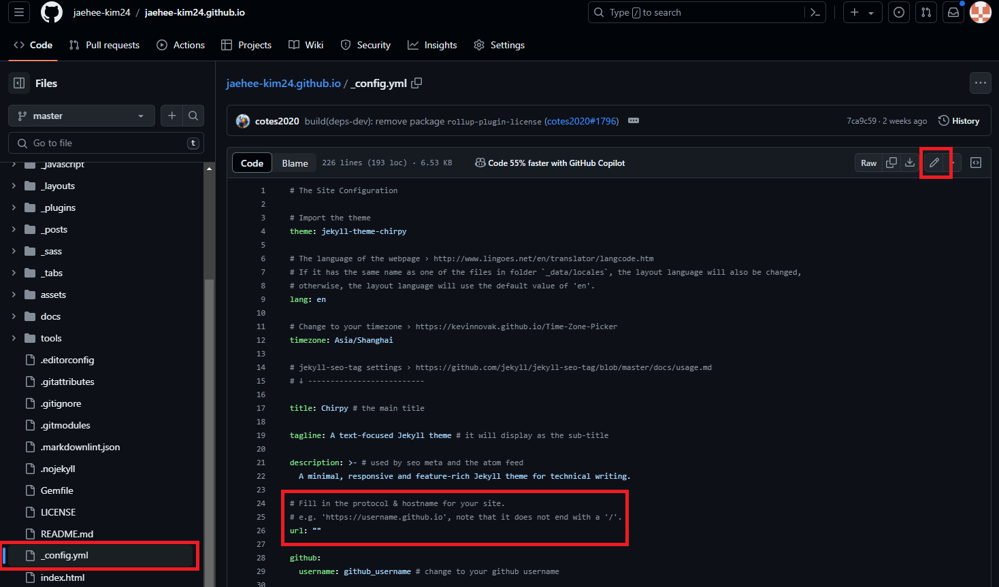  
>  _config.yml 파일 확인

가져온 Repositoy내의 _config.yml 파일을 찾아서 들어가주세요. 그럼 위쪽에 연필 모양이 뜨고, 누르면 수정이 가능합니다.  
우선 그중에서 우리는 `url`과 `baseurl`을 먼저 수정해보도록 할게요.  
둘 다 현재는 비어있을텐데 잘 찾아서 `url`에는 여러분들의 블로그 주소를, `baseurl`에는 여러분들의 github ID를 넣어주시면 됩니다.  
```url: "https://[여러분의 github 아이디].github.io"```   
```baseurl: "/[여러분의 github 아이디]"```  
이렇게요.  

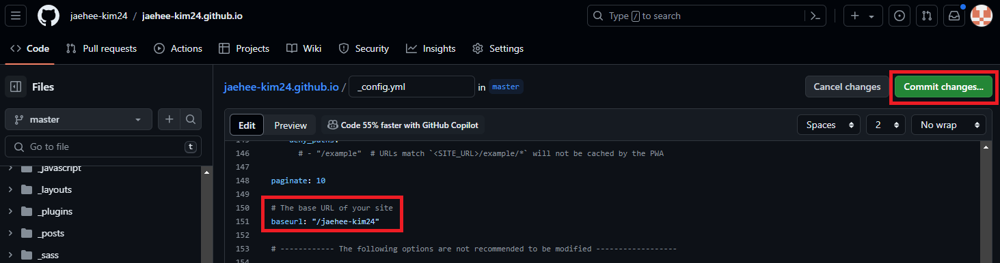  
>  수정 후 Commit changes 클릭

url과 baseurl을 수정하셨다면 위쪽 `Commit changes...`를 눌러주세요.  

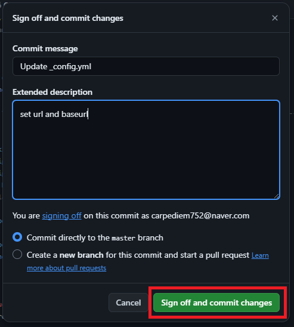  
>  Sign off and commit changes 클릭

Commit message와 Extended description를 차후 수정 내용을 알아보기 쉽도록 작성하고 `Sign off and commit changes`를 눌러줍니다.

### Jekyll Configure
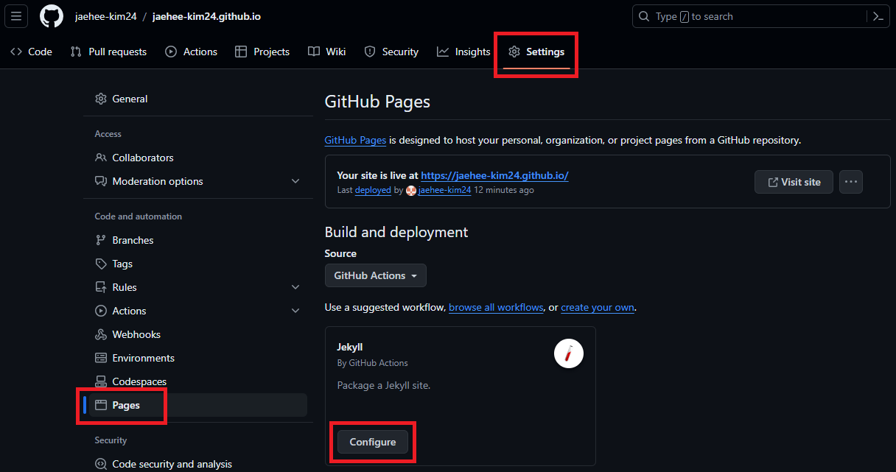  
>  Jekyll Configure 버튼 클릭

Settings 탭에서 왼쪽 사이드 바의 Pages 들어가시면 Jekyll의 Configure 버튼이 보일겁니다. 이걸 눌러주세요.  

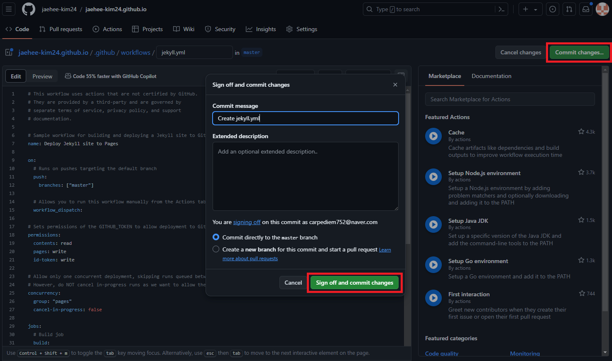  
>  아무것도 수정하지 않고 Commit 하기

해당 과정에서 .github/workflows/jekyll.yml 파일이 생성됩니다.  

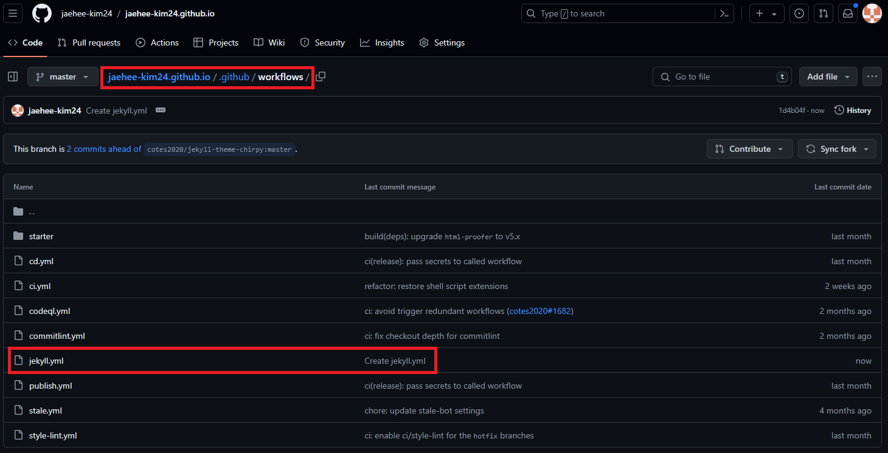  
>  jekyll.yml 파일 확인

앞에서 작성한 커밋 메시지와 함께 jekyll.yml이 생성된 것이 확인 되죠? 여기서 커밋 메시지를 클릭하면 변화된 내용을 볼 수 있습니다.  

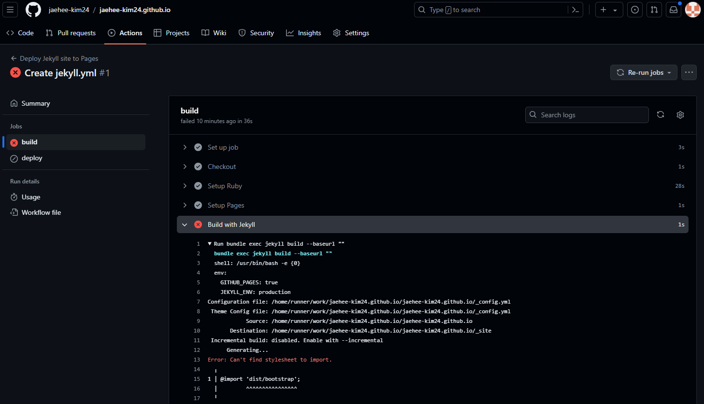  
>  build 실패

jekyll.yml이 생성되면서 Actions 탭에 보시면 다시 Build가 되는 것을 볼 수 있는데요. 성공했으면 매우매우 행복했겠지만... 실패 〒▽〒  
jekyll.yml을 사용하기전에 Chirpy 초기화를 해야하기 때문이랍니다.

## 2. Chirpy 초기화
Chirpy 초기화를 하려면 우선 로컬로 여러분의 Repository를 clone해 와야합니다.

### Clone
저는 [Github Desktop](https://desktop.github.com/ "Github Desktop 링크")을 사용합니다. GUI 없이, 프롬프트 명령어로만으로도 진행 할 수 있지만 저는 이게 편해서 사용하는 거에요! 각자 편하신 방법으로 `Clone` 하시면 됩니다!  

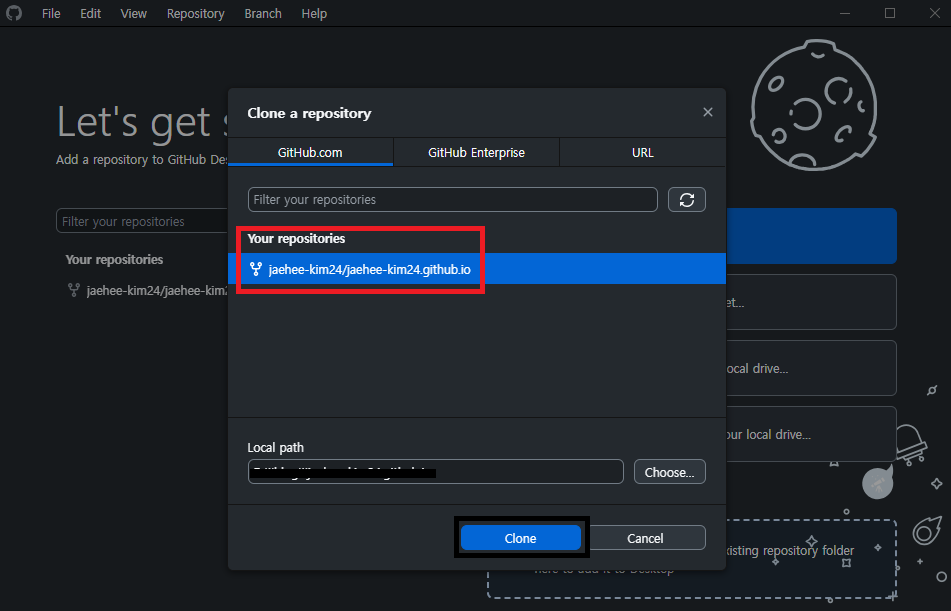  
>  Github Desktop에서 클론하기

혹시 지금 Github Desktop을 설치하셨다면, Github 로그인 해주시면 Clone 할 수 있는 버튼이 보일거에요. 그럼 우리가 가져온 Repository를 선택하고 원하는 폴더를 선택하면 여러분의 로컬 PC에 소스를 내려받을 수 있습니다.

### Ruby 설치
로컬에서 Jekyll을 사용하기 위해선 [Ruby](https://rubyinstaller.org/downloads/ "Ruby 설치 링크")를 필수로 설치해야합니다. 여러분의 환경에 맞게 꼭! **WITH DEVKIT**, **버전 3이상**으로 설치해주세요.  

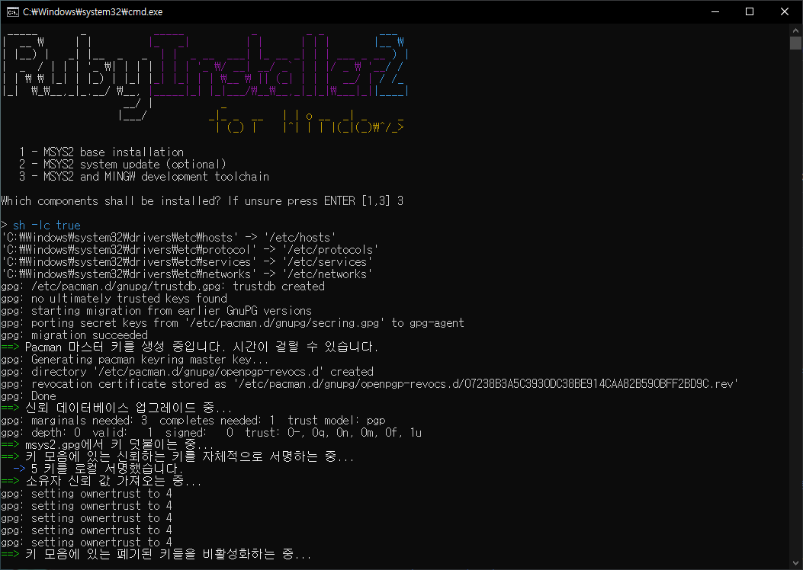  
>  Ruby 설치

해당 프롬프트 창이 뜨면 MINGW development toolchain이 포함된 3번을 설치해야합니다.  
`3`을 치고 Enter를 눌러주세요. 그럼 설치가 마저 진행될겁니다.  

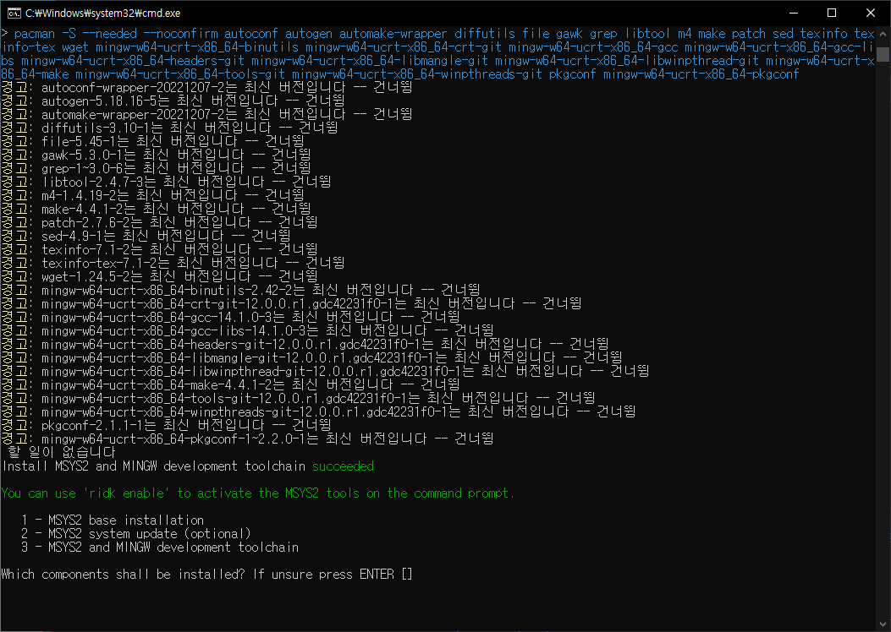  
>  Ruby 설치완료

`Istall MSY32 and MINGW development toolchain succeeded`라고 뜨면 성공한 것이므로 다음으로 넘어갈게요. 해당 창은 꺼주셔도 됩니다.

### jekyll 설치
jekyll을 설치하기 위해 윈도우 키를 누르고 명령프롬프트 혹은 cmd 라고 쳐서 새 창을 열러줍니다.  

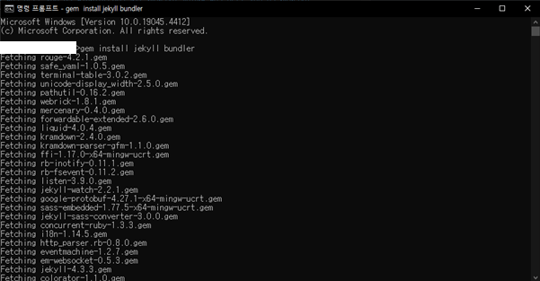  
>  \>gem install jekyll bundler

cmd 창에서 `gem install jekyll bundler`이라고 치면 설치가 주르르륵 될텐데요. 여기서 시간이 조금 소요됩니다. 여유를 갖고 기다려주세요. 

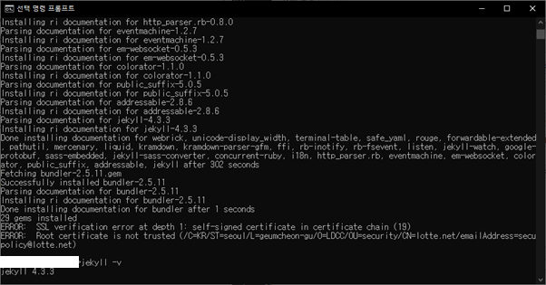  
>  \>jekyll -v

설치가 끝났다면 `jekyll -v`라고 쳐보세요. 버전이 이쁘게 나온다면 설치 성공! 이제 거의 다 왔습니다.

### 초기화
우리는 지금껏 로컬에서 초기화를 하고, 돌려보기 위해 위 Ruby와 Jekyll을 설치했습니다.  
Jekyll Chirpy 테마를 초기화 하려면 `tools/init.sh` 파일을 실행해야합니다.  
저는 Git Bash를 사용할겁니다. 우리가 아까 클론한 폴더 있죠? 그 폴더 내에서 오른쪽 마우스를 클릭 후 Git Bash를 열어볼게요. 

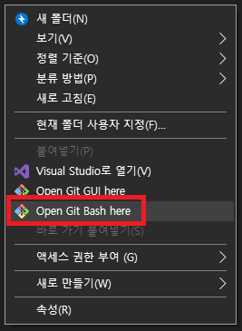  
>  Open Git Bash here

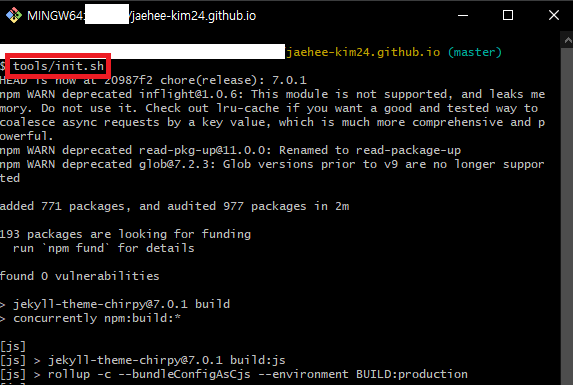  
>  $ tools/init.sh

라고 치면 또 쥬르르륵 진행될거에요. 마지막에  
`> Initialization successful!`  
이라고 나오면 초기화 성공!

>  $ bundle  
>  $ jekyll serve  

이후 `bundle` 명령어를 통해 필요한 파일들을 설치하고, `jekyll serve` 명령어를 입력하시면 로컬에서 여러분의 블로그를 돌릴 수 있습니다.  
성공한다면 https://127.0.0.1:4000/ 혹은 https://localhost:4000/ 으로 접속하시면 테마가 잘 적용된 블로그를 볼 수 있습니다.  
~~(저는 방화벽 문제로 bundle 명령어로 설치가 불가능한 환경이라, 차후에 사진을 첨부하도록 하겠습니다.)~~

## 3. 동기화 및 배포
로컬에서 초기화 과정을 진행하고 이쁘게 테마가 적용된것을 확인하셨다면 이제 배포를 해봐야겠죠?

### 동기화
현재는 로컬과 Github에 있는 코드가 다를겁니다. Github Desktop을 사용하여 로컬에서 수정된 부분을 `commit`하고 `push`해줍니다. 해당 부분 캡쳐가 없어서 죄송합니다. 여러분의 코드와 파일들이 삭제, 생성되었기 때문에 Github Desktop을 열면 상단 탭 중 오른쪽에 pull and push라고 나올테니 따라가시면 될 겁니다. `push`까지 해주셨으면 commit 내용을 확인해봅시다.

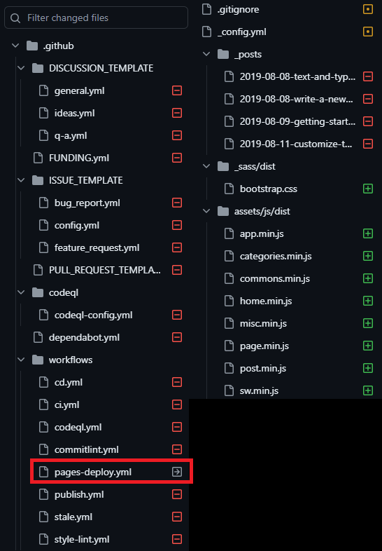  
>  tool/init.sh 실행 후 수정된 부분

보시면 템플릿들과 workflows내 파일들 그리고 _posts 하위 파일들을 삭제했네요. bootstrap.css와 assets/js/dist내 여러 js 파일들이 추가 됐구요.  
여기서 `workflows/pages-deploy.yml`이 생성되었죠? 우리는 이 파일을 삭제해줘야합니다. 삭제하는 방법은 Github 사이트 내에서 delete file을 하시고 commit 하시거나 로컬에서 파일을 삭제하시고 git으로 commit과 push 하시면 됩니다.  
즉, .github/workflows 폴더 내에는 앞서 Jekyll configure 하면서 생성한 `jekyll.yml` 파일만 남겨둡니다.

### 배포

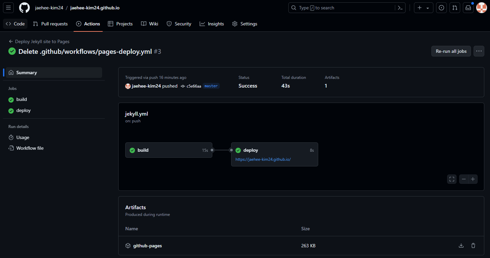  
>  build & deploy 확인

`pages-deploy.yml`를 삭제하면 Actions 에서 build 와 deploy가 새로 되는 것을 볼 수 있습니다. 이번에는 성공이네요! 오예~  

그럼 이제 접속해 볼까요?  

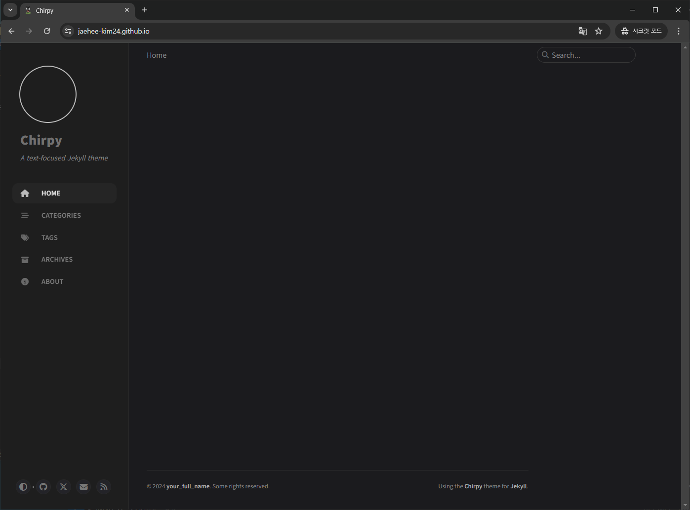  
>  테마가 적용된 블로그 개설 성공

여기까지 과정이 길었네요. 이런 저런 시행착오로 개설에 성공했는데 제 글이 누군가에게 작은 도움이라도 될 수 있길 바랍니다.  

이제부터는 블로그 커스텀을 진행해볼게요! 곧 만나요 뿅!

연관 포스팅  
- [Jekyll Chirpy 테마 Github 블로그 개설하기(2024.06 기준)-1](https://jaehee-kim24.github.io/posts/github%EB%B8%94%EB%A1%9C%EA%B7%B8_%EA%B0%9C%EC%84%A4%ED%95%98%EA%B8%B0_1/)
- [Jekyll Chirpy 테마 Github 블로그 꾸미기](https://jaehee-kim24.github.io/posts/github%EB%B8%94%EB%A1%9C%EA%B7%B8_%EA%BE%B8%EB%AF%B8%EA%B8%B0/)