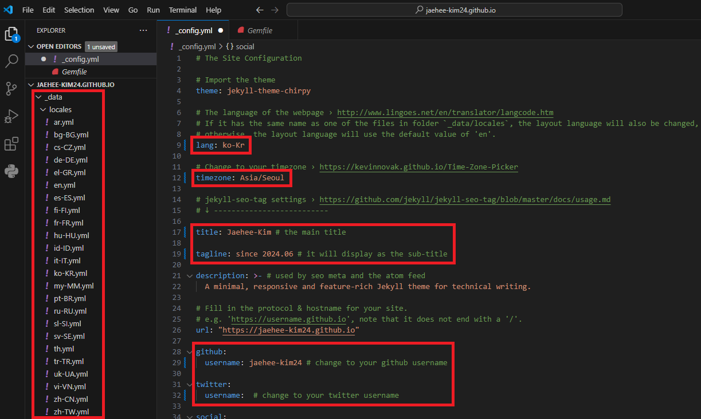
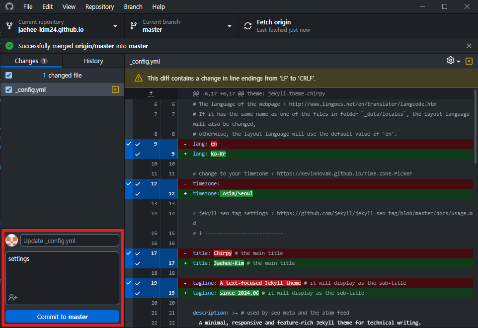
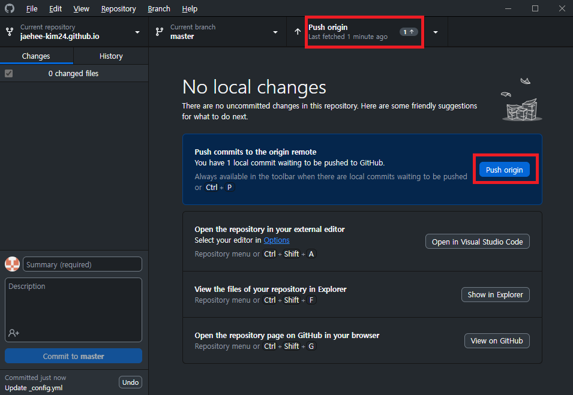
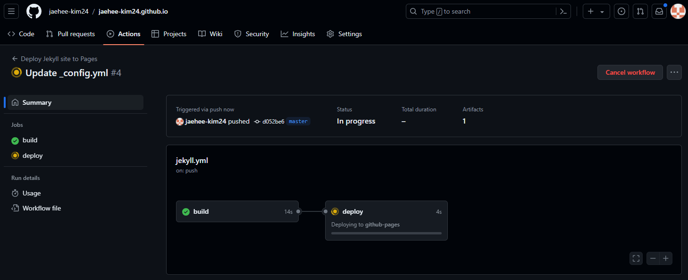
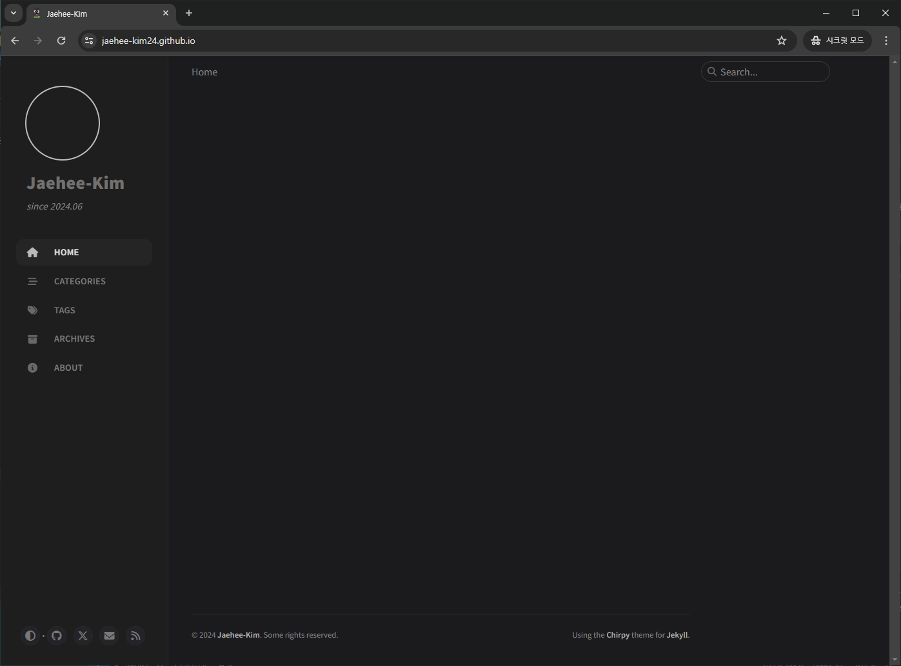
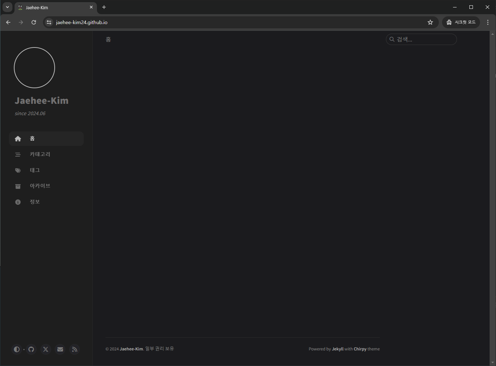

>안녕하세요 재히입니다 o((>ω< ))o  
지난 포스팅에서 Github blog를 개설했죠? 우리의 휑한 블로그를 하나하나 채워나가 보려고 합니다.  
해당글은 블로그를 수정할 때마다 조금씩 추가해볼게요. 그럼 레츠꼬~

연관 포스팅  
- [Jekyll Chirpy 테마 Github 블로그 개설하기(2024.06 기준)-1](https://jaehee-kim24.github.io/posts/github%EB%B8%94%EB%A1%9C%EA%B7%B8_%EA%B0%9C%EC%84%A4%ED%95%98%EA%B8%B0_1/)  
- [Jekyll Chirpy 테마 Github 블로그 개설하기(2024.06 기준)-2](https://jaehee-kim24.github.io/posts/github%EB%B8%94%EB%A1%9C%EA%B7%B8_%EA%B0%9C%EC%84%A4%ED%95%98%EA%B8%B0_2/)

# 나만의 맞춤 GitHub Blog 만들기
지금 배포한 블로그는 나의 것이 아니라는 느낌이 많이 들지 않나요? 저는 그랬어요! 뭔가 빨리 나의 흔적을 가득 남기고 싶었답니다.  
빤니빤니 가보자구요!!

## 1. _config.yml 수정
기본적 설정 내용들이 담겨있는 파일입니다. 우선 제가 수정한 부분을 보여드릴게요.  

### yml 파일 수정하기
  
>  lang, timezone, title, tagline, github-username 수정
- **lang** : 언어 설정입니다. `/_data/locales` 아래에 보면 많은 언어 파일들이 있어요. 기본은 영언데 저는 한국어로 바꾸려고 `ko-KR`로 수정했습니다. `ko-KR.yml` 파일을 한번 살펴보세요. 한국어 번역이 마음에 들지 않는다면 여러분이 직접 수정하실수도 있습니다.
- **timezone** : `Asia/Seoul` 한국 시간으로 설정해야겠죠? 저는 기본이 상하이로 되어있더라구요. 서울의 시간으로 변경해줍니다.
- **title** : 블로그 제목으로 왼쪽 사이드 바, 아바타 이미지 아래쪽에 오는 굵은 글씨에 들어갈 내용을 적어주시면 됩니다.
- **tagline** : title 아래쪽에 오는 설명을 적는 곳입니다.
- **username** : github와 twitter 의 아이디를 적어주시면 되는데 저는 트위터는 하지 않아 비워두었습니다. 나중에 삭제 하는 것도 해볼게요.

나머지 부분은 수정 할 때 더 추가하도록 하겠습니다.  

### yml 파일 commit과 push
로컬에서 파일을 수정했다면 commit과 push를 해서 github에 있는 소스와 동기화를 해야겠죠? 저는 역시 Github Desktop 사용할겁니다!

  
>  commit to master 클릭

VSCode에서 _config.yml 파일을 수정하고 저장만 잘 해주셨다면 Github desktop에서는 자동으로 수정된 부분을 위와 같이 보여줄 겁니다.  
commit 할 파일 체크하고 commit message를 적어서 `commit to master`를 눌러주세요.  
_(VSCode에서도 commit하고 push할 수 있습니다. 편한 방법으로 진행하시면 됩니다.)_

  
>  Push origin 클릭  

Commit이 완료되었으면 Push 해주세요! 빨간 네모 중 아무거나 누르면 됩니다.

### 수정 yml 파일 배포
_config.yml 파일이 수정되면 자동으로 다시 build 하고 deploy하는데요. 이는 Actions 탭에서 확인 할 수 있습니다. 

  
>  자동으로 build 되고 deploy

잠시만 기다리면!! 짜잔

  
>  설정 적용된 블로그 확인

이렇게 설정이 모두 적용 된... ~~아니 왜 한글이 안나왔지?~~  
잘 보니까 `lang: ko-Kr`로 작성했더라구요... `ko-KR`입니다. 왜냐? 파일 이름이 `ko-KR.yml`이니까~ 다시 수정하고 commit과 push합니다.  

그럼 진짜 진짜로 짜잔!!  

  
>  한국어까지 설정 적용된 블로그 확인

휴우 이번엔 모두 잘 되었네요. title과 tagline이 잘 적용되었고, 한국어까지도 잘 나오고 있습니다.  

아직도 휑하네요. 일단 저기 빈 사진 공간부터 채워보겠습니다.