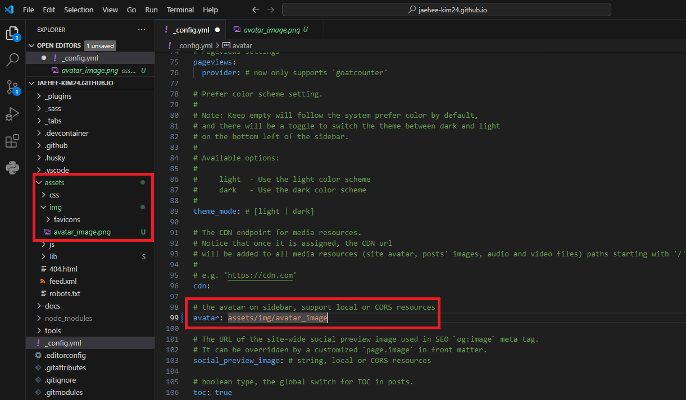
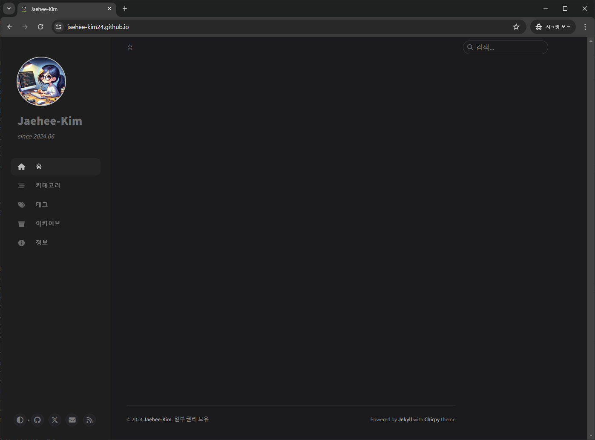
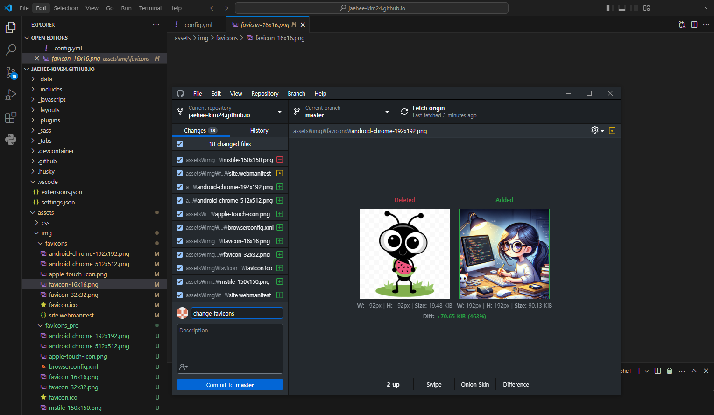
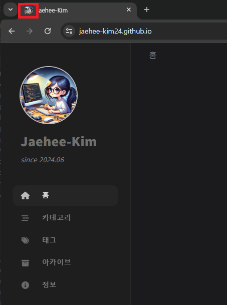

>안녕하세요 재히입니다 o((>ω< ))o  
지난 포스팅에서 Github blog를 개설했죠? 우리의 휑한 블로그를 하나하나 채워나가 보려고 합니다.  
해당글은 블로그를 수정할 때마다 조금씩 추가해볼게요. 그럼 레츠꼬~

연관 포스팅  
- [Jekyll Chirpy 테마 Github 블로그 개설하기(2024.06 기준)-1](https://jaehee-kim24.github.io/posts/github%EB%B8%94%EB%A1%9C%EA%B7%B8_%EA%B0%9C%EC%84%A4%ED%95%98%EA%B8%B0_1/)  
- [Jekyll Chirpy 테마 Github 블로그 개설하기(2024.06 기준)-2](https://jaehee-kim24.github.io/posts/github%EB%B8%94%EB%A1%9C%EA%B7%B8_%EA%B0%9C%EC%84%A4%ED%95%98%EA%B8%B0_2/)

# 나만의 맞춤 GitHub Blog 만들기
지금 배포한 블로그는 나의 것이 아니라는 느낌이 많이 들지 않나요? 저는 그랬어요! 뭔가 빨리 나의 흔적을 가득 남기고 싶었답니다.  
빤니빤니 가보자구요!!

현재까지 수정 내역은 아래와 같습니다. 
1. [**\_config.yml 수정**](https://jaehee-kim24.github.io/posts/github%EB%B8%94%EB%A1%9C%EA%B7%B8_%EA%BE%B8%EB%AF%B8%EA%B8%B0/#1-_configyml-%EC%88%98%EC%A0%95)  
2. [**Avatar 설정**](https://jaehee-kim24.github.io/posts/github%EB%B8%94%EB%A1%9C%EA%B7%B8_%EA%BE%B8%EB%AF%B8%EA%B8%B0/#2-avatar-%EC%84%A4%EC%A0%95)  
3. [**Favicon 설정**](https://jaehee-kim24.github.io/posts/github%EB%B8%94%EB%A1%9C%EA%B7%B8_%EA%BE%B8%EB%AF%B8%EA%B8%B0/#3-favicon-%EC%84%A4%EC%A0%95)    

아래부터는 상세 내용을 기록해볼게요.

## 1. _config.yml 수정
기본적 설정 내용들이 담겨있는 파일입니다. 우선 제가 수정한 부분을 보여드릴게요.  

### yml 파일 수정하기
  
>  lang, timezone, title, tagline, github-username 수정
- **lang** : 언어 설정입니다. `/_data/locales` 아래에 보면 많은 언어 파일들이 있어요. 기본은 영언데 저는 한국어로 바꾸려고 `ko-KR`로 수정했습니다. `ko-KR.yml` 파일을 한번 살펴보세요. 한국어 번역이 마음에 들지 않는다면 여러분이 직접 수정하실수도 있습니다.
- **timezone** : `Asia/Seoul` 한국 시간으로 설정해야겠죠? 저는 기본이 상하이로 되어있더라구요. 서울의 시간으로 변경해줍니다.
- **title** : 블로그 제목으로 왼쪽 사이드 바, 아바타 이미지 아래쪽에 오는 굵은 글씨에 들어갈 내용을 적어주시면 됩니다.
- **tagline** : title 아래쪽에 오는 설명을 적는 곳입니다.
- **username** : github와 twitter 의 아이디를 적어주시면 되는데 저는 트위터는 하지 않아 비워두었습니다. 나중에 삭제 하는 것도 해볼게요.

나머지 부분은 수정 할 때 더 추가하도록 하겠습니다.  

### yml 파일 commit과 push
로컬에서 파일을 수정했다면 commit과 push를 해서 github에 있는 소스와 동기화를 해야겠죠? 저는 역시 Github Desktop 사용할겁니다!

  
>  commit to master 클릭

VSCode에서 \_config.yml 파일을 수정하고 저장만 잘 해주셨다면 Github desktop에서는 자동으로 수정된 부분을 위와 같이 보여줄 겁니다.  
commit 할 파일 체크하고 commit message를 적어서 `commit to master`를 눌러주세요.  
_(VSCode에서도 commit하고 push할 수 있습니다. 편한 방법으로 진행하시면 됩니다.)_

  
>  Push origin 클릭  

Commit이 완료되었으면 Push 해주세요! 빨간 네모 중 아무거나 누르면 됩니다.

### 수정 yml 파일 배포
_config.yml 파일이 수정되면 자동으로 다시 build 하고 deploy하는데요. 이는 Actions 탭에서 확인 할 수 있습니다. 

  
>  자동으로 build 되고 deploy

잠시만 기다리면!! 짜잔

  
>  설정 적용된 블로그 확인

이렇게 설정이 모두 적용 된... ~~아니 왜 한글이 안나왔지?~~  
잘 보니까 `lang: ko-Kr`로 작성했더라구요... `ko-KR`입니다. 왜냐? 파일 이름이 `ko-KR.yml`이니까~ 다시 수정하고 commit과 push합니다.  

그럼 진짜 진짜로 짜잔!!  

  
>  한국어까지 설정 적용된 블로그 확인

휴우 이번엔 모두 잘 되었네요. title과 tagline이 잘 적용되었고, 한국어까지도 잘 나오고 있습니다.  

## 2. Avatar 설정
대략적 설정을 마치니 눈에 들어오는건 Title 위쪽의 진 사진 공간.  
여기에 여러분이 넣고 싶은 사진을 넣으시면 됩니다.

### Avatar 사진 다운로드  
저는 어떤 사진을 넣을지 한참을 고민하다, AI에게 그려달라고 했어요! 생각보다 괜찮아서 바아로 채택. ~~(요즘 AI없이 못살겠다)~~
 
여러분이 선택한 이미지는 `assets/img` 밑에 넣어주세요.

### \_config.yml에 추가
  
>  Avatar 이미지 경로 설정

1. \_config.yml 수정  
2. commit & push
3. build & deploy

\_config.yml에서 `avatar:` 이라고 되어있는 라인을 찾아주세요. 그리고 우리가 이미지를 넣은 경로를 추가하시면 됩니다.  
저 같은 경우엔 `avatar: assets/img/avatar_img.png`로 수정했습니다.  
사진에는 avatar_img라고만 되어있는데 .png 확장자까지 적어주셔야합니다. 저는 다시 했네요 ㅠㅠ  
\_config.yml 파일을 수정했다면, 저장하시고 commit과 push를 해주세요. 그럼 다시 build와 deploy 과정을 거치게 됩니다.

잘 따라해주셨다면, 짜잔!!

  
>  Avatar 적용 완료

## 3. Favicon 설정
아바타까지 완성했다면, 이제 Favicon을 설정할 차례입니다.  

### Favicon 만들기

저는 아바타와 같은 이미지로 Favicon을 만들어 보겠습니다. Favicon을 만들어주는 사이트는 많아요. 전 구글에 검색해서 가장 먼저 나온 사이트에서 진행했습니다. 링크는 아래 달아둘게요.  
[https://favicon.io/favicon-converter/](https://favicon.io/favicon-converter/ "Favicon 생성 사이트 링크")  
만드는 과정은 어렵지 않아요. 그냥 Favicon 이미지를 넣고 다운로드 하면 zip 파일로 내려 받을 수 있습니다.

### Favicon 파일 교체

Favicon zip파일을 받으셨다면, `asset/favicon` 폴더 내로 복사 해주시면 됩니다. zip 파일을 복사하는게 아닌, 압축 폴더 내 파일들을 넣어주셔야합니다!! 아래 사진에서 제가 한 것처럼요.

  
>  Favicon 이미지 넣기

1. `asset/favicon` 폴더로 favicon 파일들 복사 
2. commit & push
3. build & deploy  

넣어주셨다면 배포를 해주자구요! commit 하시고 push 해주시면 자동으로 build 하고 deploy 할겁니다.  
모두 성공하셨다면, 짜잔~

  
>  Favicon 이미지 적용 완료

혹시 바로 적용되지 않았다, 아직도 개미가 보이는뎁쇼? 하시는 분들은 `Ctrl+Shift+R`(또는 Ctrl+F5) 눌러보세요.  
웹 개발하던 습관 때문에 저는 F5보다 Ctrl+Shift+R이 더 익숙한데요, 이는 강력한 새로고침?이라고 말할 수 있어요. 이 경우 브라우저는 캐시를 무시하고 모든 리소스를 서버에서 다시 다운로드 한답니다. 그래서 페이지의 최신 버전을 확인 할 수 있게 해줘요. 따라서 페이지를 업데이트 했지만, 브라우저 캐시 때문에 변경 사항이 반영되지 않는다면 Ctrl+Shift+R을 사용해보세요!

여기까지 했으면 이제 좀 나의 블로그 같지 않나요? 저는 여기서 댓글, 방문자 수 확인 기능들을 추가할거에요. 그 부분들도 진행하면서 포스팅 할게요! 

다음 포스팅은 구글과 타 다른 검색 사이트들에 내 블로그를 노출하는 방법에 대해 알아볼거에요. 여러분이 지금까지 잘 따라왔다고 해도 구글이나 다른 검색 사이트에 찾아본들 나오지 않을 거거든요. 열심히 작성하고 있는 내 블로그에 다른 사람들이 찾아 들어오게 해야겠죠? 그 방법을 함께 알아보도록 해요.

그럼 곧 만나요 뿅!