>안녕하세요 재히입니다 o((>ω< ))o  
[Jekyll Chirpy 테마 Github 블로그 꾸미기](https://jaehee-kim24.github.io/posts/github%EB%B8%94%EB%A1%9C%EA%B7%B8_%EA%BE%B8%EB%AF%B8%EA%B8%B0/)까지 잘 따라오신 분들! 나만의 블로그를 빨리 세상에 내놓고 싶진 않으신가요?  
그치만 아직까지 검색을 아무리 해도 내 블로그가 나오지 않을거에요. 이번 포스팅에서는 검색 엔진에 노출시키는 방법을 알아보겠습니다. 어서 우리의 블로그를 자랑해보자구요🚀

연관 포스팅  
- [Jekyll Chirpy 테마 Github 블로그 개설하기(2024.06 기준)-1](https://jaehee-kim24.github.io/posts/github%EB%B8%94%EB%A1%9C%EA%B7%B8_%EA%B0%9C%EC%84%A4%ED%95%98%EA%B8%B0_1/)  
- [Jekyll Chirpy 테마 Github 블로그 개설하기(2024.06 기준)-2](https://jaehee-kim24.github.io/posts/github%EB%B8%94%EB%A1%9C%EA%B7%B8_%EA%B0%9C%EC%84%A4%ED%95%98%EA%B8%B0_2/)
- [Jekyll Chirpy 테마 Github 블로그 꾸미기](https://jaehee-kim24.github.io/posts/github%EB%B8%94%EB%A1%9C%EA%B7%B8_%EA%BE%B8%EB%AF%B8%EA%B8%B0/)
  

# Google Search Console
먼저, Google Search Console에 블로그를 등록해야 합니다. 이 도구는 Google이 내 블로그를 어떻게 인식하고 있는지 확인할 수 있게 해줘요.

## 1. Google Search Console에 블로그 등록하기
### Google Search Console 접속
[Google Search Console](https://search.google.com/search-console/about)로 이동해요.  
다들 Google 아이디로 로그인 해주시고 시작하기를 눌러봅시다.
  
>  시작하기 버튼 클릭

### 속성 추가
  
>  URL 입력후 계속 버튼 클릭

### 소유권 확인
위에서 URL 입력하고 계속 한다면, 잠시 기다리면 아래와 같은 화면이 나옵니다. 
  
> 소유권 확인 방법

- HTML 파일 추가
- HTML 태그 추가
- Google 애널리틱스
- Google 태그 관리자
- 도메인 이름 공급업체
  
위 방법들로 소유권을 확인 할 수 있습니다. 그 중 저는 **HTML 태그 추가**를 사용할거에요. Jekyll 블로그에는 HTML 파일 추가의 방법으로는 적용이 어려울 수 있습니다.

#### HTML 태그
  
> 다른 방법 확인 -> HTML 태그 -> 복사  

아직까지는 확인 버튼 누르면 안돼요!! 적용이 되지 않았기 때문에 에러가 날거에요. 아래 내용부터 따라해주세요.

#### _config.yml에 content 붙여넣기
복사한 내용을 보면 저 같은 경우  
`<meta name="google-site-verification" content="blahblah" />`  
이렇게 나옵니다. `blahblah` 부분을 _config.yml에 붙여 넣을거에요.
  
> webmaster_verifications: 아래의 google에 `blahblah` 붙여넣기

#### Commit & Push & Build & Deploy
지금까지 따라오신 분들은 커밋과 푸시, 빌드와 디플로이가 익숙하실텐데요. 혹시 못보신 분들은 [yml 파일 commit과 push](https://jaehee-kim24.github.io/posts/github%EB%B8%94%EB%A1%9C%EA%B7%B8_%EA%BE%B8%EB%AF%B8%EA%B8%B0/#yml-%ED%8C%8C%EC%9D%BC-commit%EA%B3%BC-push) 부분을 참고 해주세요.  

#### 배포 완료 후 확인
Github의 Action 탭에서 배포를 확인 한 후, 이제 확인 버튼을 눌러볼게요.
  
> 확인 버튼 클릭

### 성공 화면
잘 작성해 주셨다면, 아래와 같은 화면이 나올겁니다.
  
> 소유권 확인 완료 후 속성으로 이동

## 2. 사이트맵 제출하기

### 사이트 맵(sitemap.xml)이란?

우리는 Google Search Console에 블로그 등록까지 했어요. 그럼 이제 서치 로봇들이 우리 사이트를 크롤링 할 수 있게 도와줄 사이트 맵이 필요합니다.  

### 사이트 맵 접속해보기
뭔가 이름만 들어도 골치 아프고 직접 관리하기 어려울 것 같지 않나요? 그치만 우리의 착한 github는 이것까지 관리해줍니다.  
sitemap.xml 파일은 루트 아래에 있다는데 파일이 안보여요~ 하시는 분들 주목!!  
여러분의 github 블로그 주소 뒤 `/sitemap.xml`을 입력하고 들어가보세요.  
제 블로그의 경우 
[https://jaehee-kim24.github.io/sitemap.xml](https://jaehee-kim24.github.io/sitemap.xml)에 접속하면 이미 만들어진 sitemap.xml 파일을 볼 수 있답니다.  

혹시나 직접 작성하고 수정, 관리 하고 싶으신 분들은 [플러그인 없이 Jekyll Sitemap 만들기](https://dveamer.github.io/homepage/Sitemap.html) 블로그를 참고해주세요. 정리를 정말 잘해주셨더라구요.  
저도 나중에 참고해서 설정들을 조금 바꿔보려구요. 그 때가 되면 그 부분도 포스팅 해볼게요.  

### 사이트 맵 제출하기
`sitemap.xml` 파일의 존재를 확인하셨다면 아까 Google Search Console의 속성에 등록해 볼까요?

  
> Sitemaps 탭 -> 새 사이트맵 추가 -> url 작성 -> 제출

그럼 아래와 같이 제출 확인 창이 하나 뜹니다.

  

### 사이트 맵 제출 버그
그치만 왠걸!!

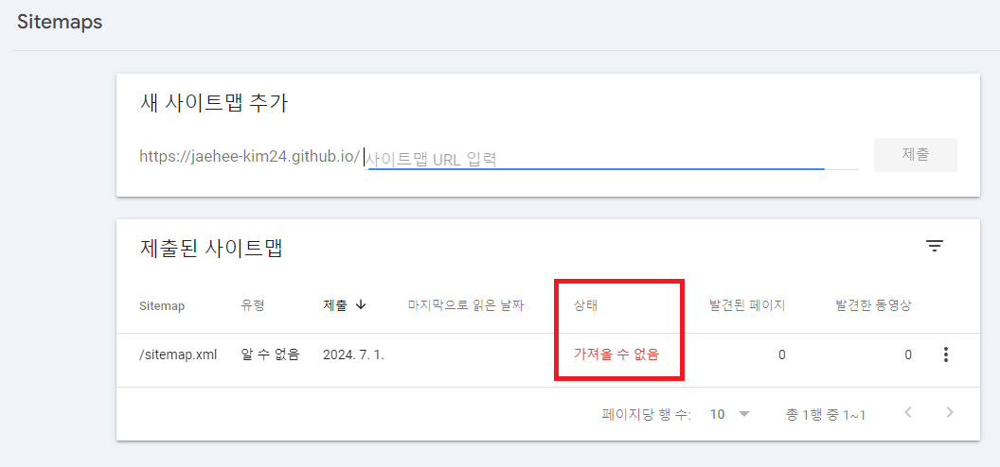  
> 가져올 수 없음

가져올 수 없음??? 왜!!! 가져와 줘!!!  
속상한 마음에 클릭 클릭!! 상세내용을 봐도 

  
> 읽을 수 없음

읽을 수 없다니?!?! 링크도 잘 들어가지잖아!!!  
놀란 마음을 쓸어내리고 검색을 좀 해봤습니다. 그 결과 이는 화면 상의 버그이고 실제로는 정상적으로 동작한다고 합니다. 단, `사이트 맵을 읽을 수 없음`이라고 나오면서 다른 메시지가 없어야 한다고 하네요. 휴우..  

### 사이트 맵 처리 완료
제가 오전에 등록하고 오류가 떴었단 말이죠? 근데 오후가 되어서 혹~시나 해서 확인 해보니 짜잔!! 바껴있네요. 여러분도 반나절 정도 있다가 확인 해보세요.

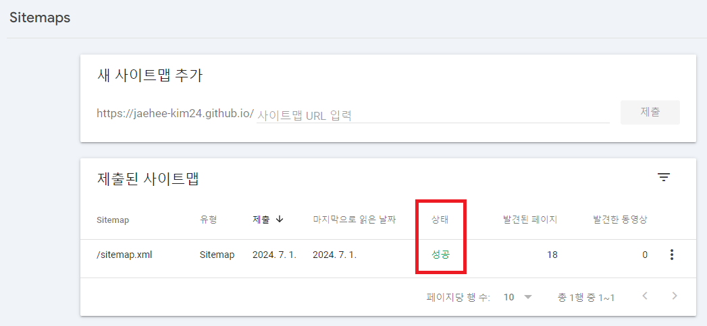  
> 성공

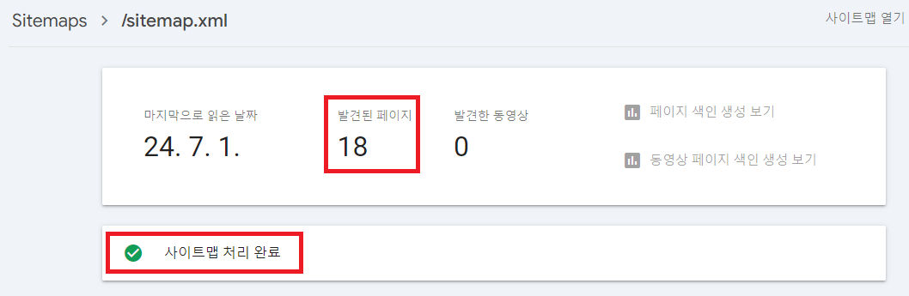  
> 사이트 맵 처리 완료

## 3. 결과 확인
그럼 이제 내 블로그가 google에 검색이 되겠지? 희희😁

### Google에 검색 (현재 날짜 2024.07.01)  
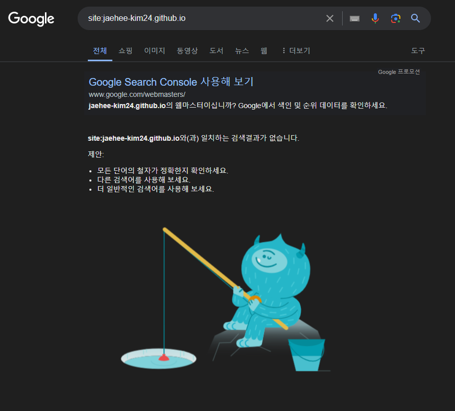  
> 일치하는 검색결과가 없습니다.  

하지만 아쉽게도... `site:` 연산자를 사용해서 검색해 봤는데 여전히 아무것도 나오지 않네요😂 [site:](https://developers.google.com/search/docs/monitor-debug/search-operators/all-search-site?hl=ko) 연산자에 대해 궁금하신분은 내용 참고하시구요!  

보통 며칠이 걸리는 일이라고 하니 며칠 뒤 다시 올게요. 그리고 뒷 내용을 마저 작성하겠습니다.

그럼 우선 안뇽 뿅!

### 메인 링크 노출 성공 (현재 날짜 2024.07.15) 
별 생각없이 구글에 내 블로그를 검색해 본 오늘!!  
드! 디! 어!  
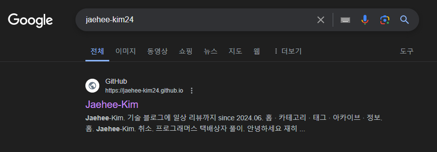  

드디어 떴어요!!! 제!!! 블로그가!!! 드디어!!!  
그동안 너무 안되서 뭔가 잘못된건 아닐까 걱정했거든요.  

#### feed.xml 추가
아, 그래서 사이트맵에 feed.xml도 추가했어요. 이거랑 상관이 크게 없을 것 같긴 하지만 혹시나 원하시는 분들은, 추가해주시면 됩니다.  
Chirpy 테마를 쓰시는 분들이라면 feed.xml 파일을 루트 아래에서 찾을 수 있을거에요. 추가는 간단합니다.

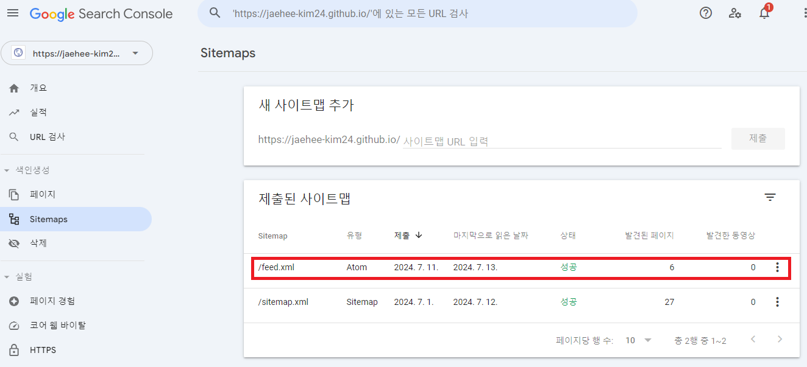  
> 처음에 상태가 성공이 아니더라도 괜찮아요. 잘못된 파일이 아니라면 조금 있으면 성공으로 바뀔겁니다!

#### 페이지 색인 확인
그치만 아직 다 성공한 것은 아니에요. 블로그내 다른 포스팅은 검색이 안되고 있죠. 아래 사진을 봐주세요.

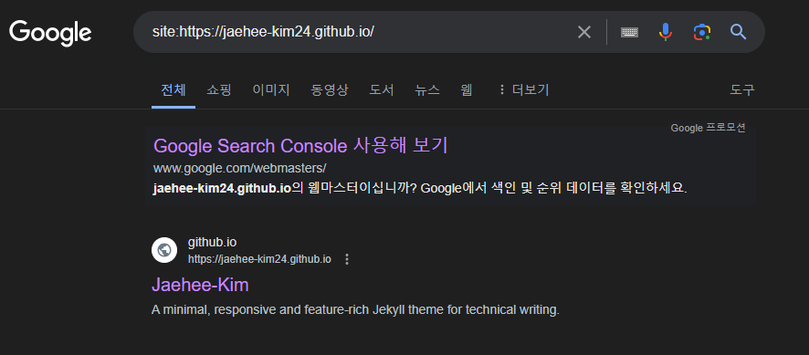  
> 딱 메인링크만 나오고 다른 포스팅 글은 나오지 않습니다.  

~~A minimal, responsive and feature-rich Jekyll theme for technical writing.ㅋㅋㅋ 블로그 설명으로 나오는 이건 언능 수정해야겠네요. 이부분은 블로그 꾸미기 포스팅에서 다룰게요.~~

확인하기 위해 Google Search Console을 켭니다.  
페이지 탭을 보니 메인페이지를 제외하고 모든 페이지가 색인이 생성되지 않았더라구요.  

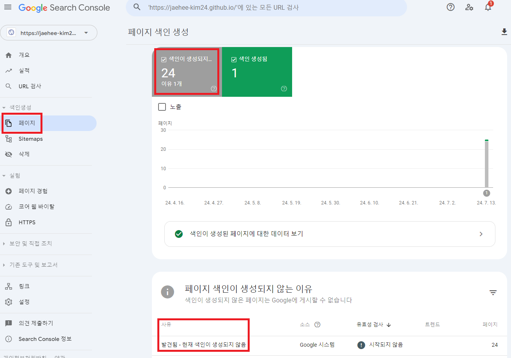  
> 메인 페이지를 제외하곤 색인이 생성되지 않았습니다.  

곰곰히 생각을 해봤어요. 사실은 제가 노출이 되길 기다리다~ 기다리다~ 메인페이지는 색인 생성을 수동으로 해줬거든요. 그래서 메인 페이지만 나온 걸까? 싶더라구요. 그래서 남은 페이지들도 모두 수동으로 해줘야하나 고민하다가, 우선 조금 더 기다려보기로 했습니다.  

수동으로 색인 생성하는 방법을 궁금해 하실 수도 있으니 남겨둘게요.

#### 수동 색인 생성
저처럼 기다리기 힘들다, 나는 직접 하겠다! 하시는 분들은 따라와주세요!

우선 위 검색창에 원하는 페이지의 링크를 적습니다.

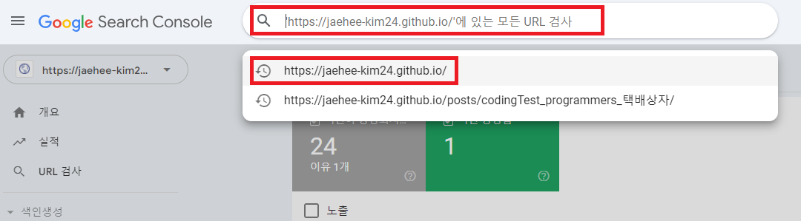  
> URL 검사하고 싶은 링크 검색.  

저는 우선 메인 링크를 검색합니다. 제 경우엔 미리해줬기 때문에 페이지가 공개상태로 나오네요.

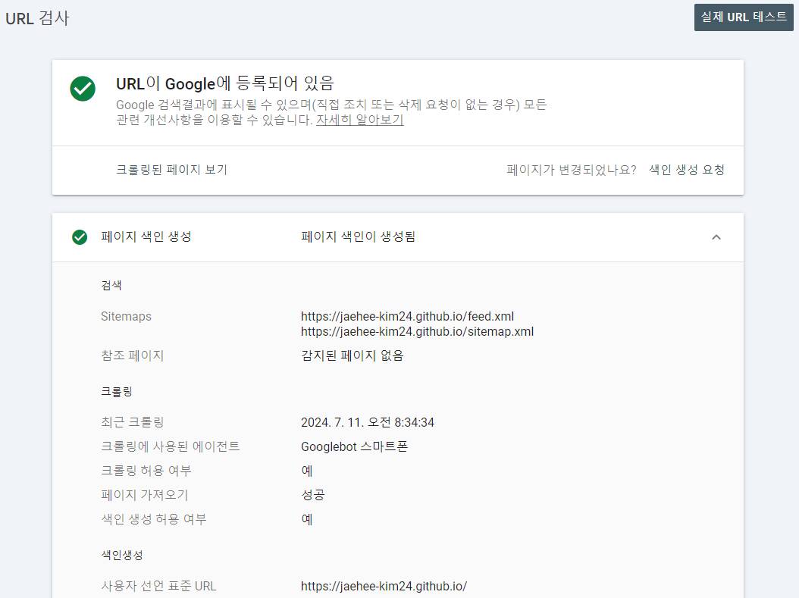  
> 색인 생성 완료된 페이지  

하지만 아직 색인이 생성되지 않은 링크를 검색하면 아래와 같이 나옵니다.

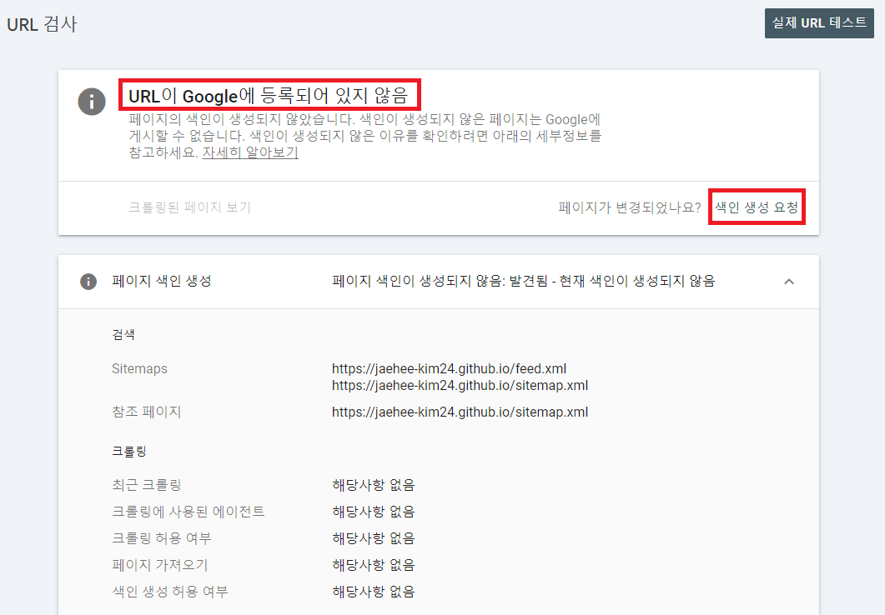  
> 색인 생성 안된 페이지의 경우. 색인 생성 요청 버튼 클릭.  

위 순서로 원하시는 페이지마다 색인 생성 요청 버튼을 눌러주세요. 그럼 금방 반영될겁니다.  

저는 위 방법으로 메인 페이지를 수동으로 동록했어요. 등록하고도 며칠은 페이지 탭에 반영중이라고 기다려야한다고 나오더라구요. 그리고 오늘 드디어 페이지 탭의 그래프와 개요, 실적 탭도 볼 수 있게 되었습니다.

저는 나머지 페이지들이 자동으로 반영되길 기다려볼텐데요. 얼마나 걸릴지, 또 기다리다가 포기하고 다 수동으로 등록해버릴지 모르겠습니다.

변화가 있으면 업데이트 할게요! 뿅!!