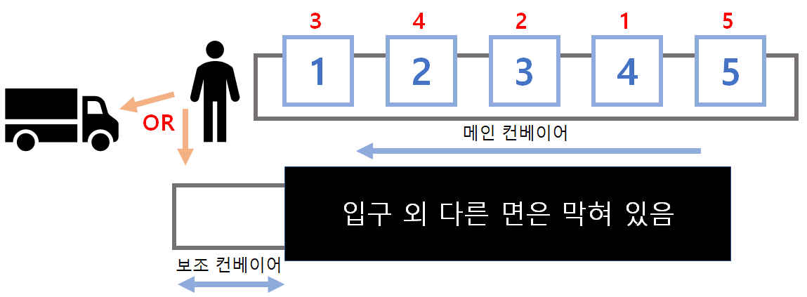
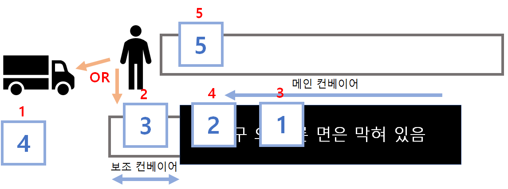
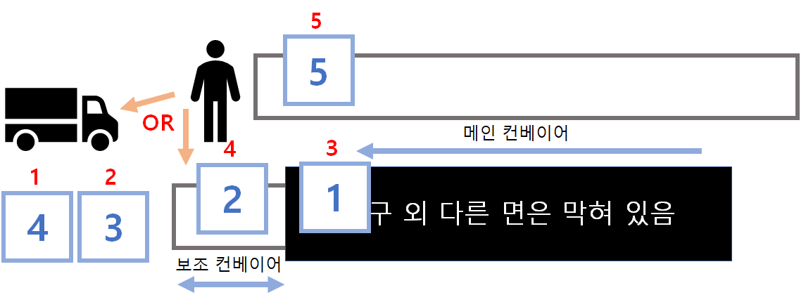
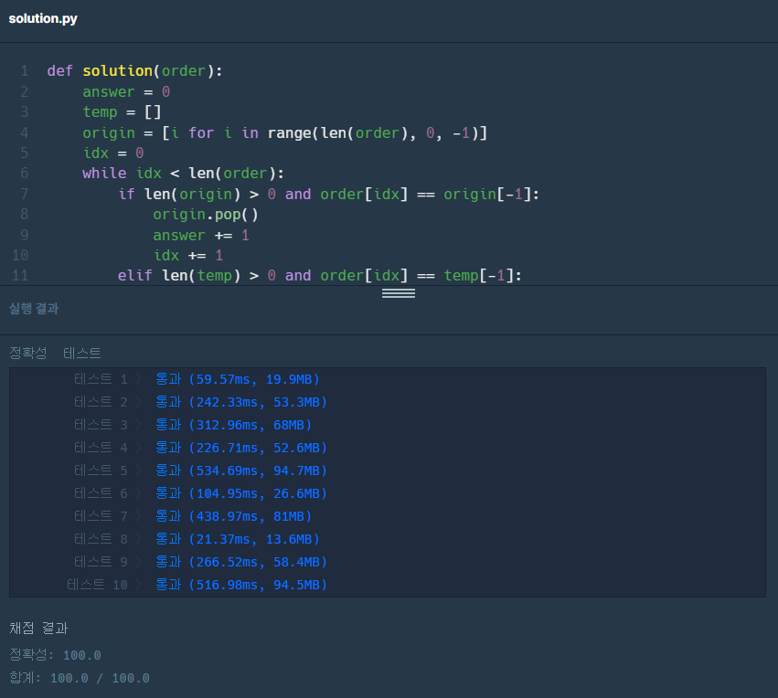
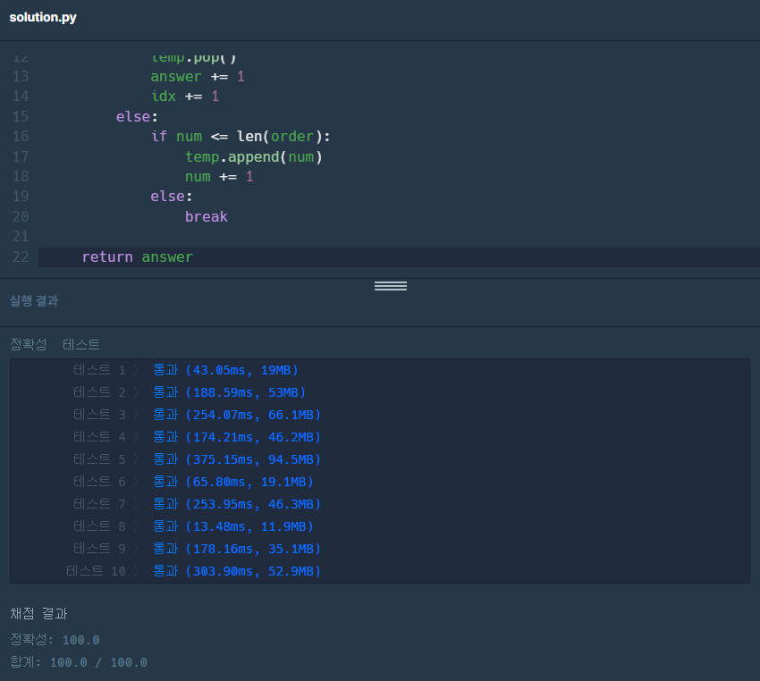
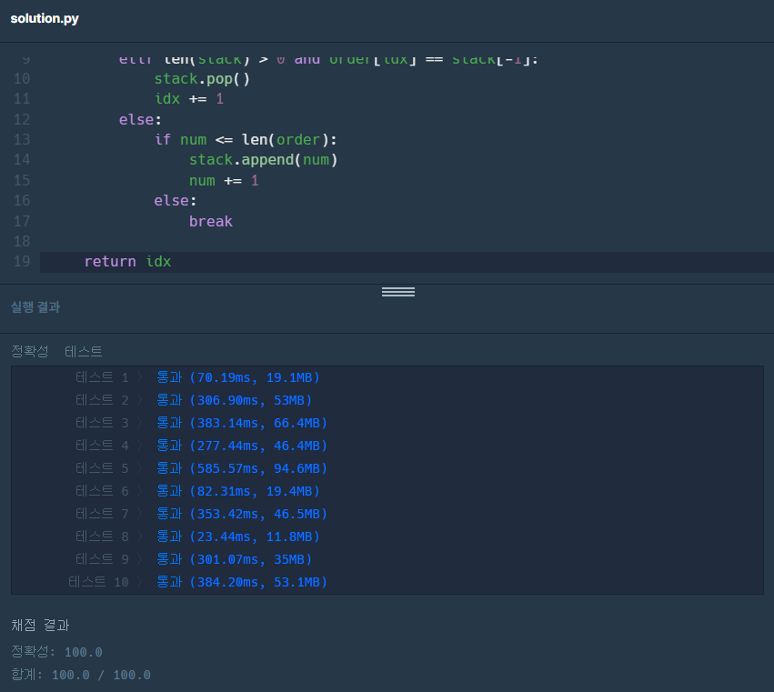
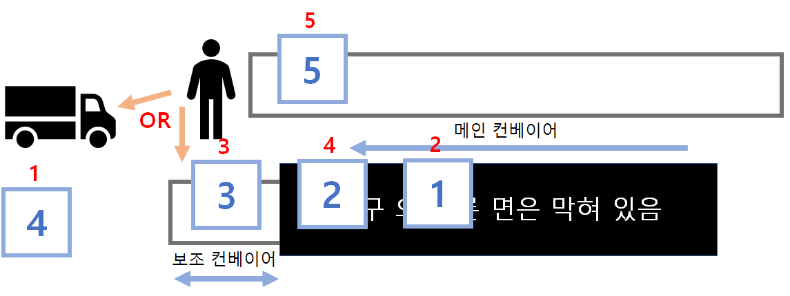
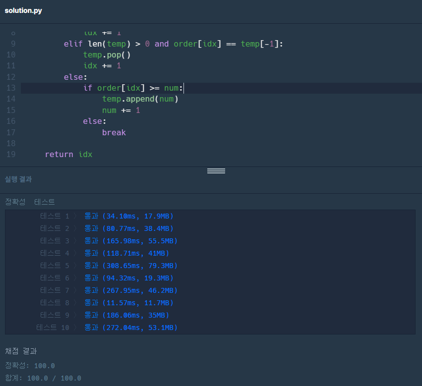

>안녕하세요 재히입니다 o((>ω< ))o  
코딩 테스트 포스팅은 처음이네요. 요즘 틈틈이 코딩 테스트 문제들을 풀면서 감을 잃지 않으려고 노력하고 있어요.  
앞으로는 푸는 것에서 그치지 않고 그 과정을 기록으로 남겨보려고 합니다.  
저를 위해 남기는 것이지만, 호~~옥시나 누군가에게 도움이 됐으면 더 좋겠네요.  
제 코드에 대해 질문이나 더 멋진 방법이 있다면 댓글 달아주세요. 무족권 환영합니다👍  
__저는 기본적으로 python3로 풀이합니다.__

저는 첫번째 정답에서 그치지 않습니다. 최선의 결과를 얻기 위해 몇 번의 다른 답을 제출 할 텐데, 그 과정을 함께 공유하도록 하겠습니다.  
그 과정이 길 수도 있기 때문에, 최종 답안이 궁금하신 분들은 [최종](https://jaehee-kim24.github.io/posts/codingTest_programmers_%ED%83%9D%EB%B0%B0%EC%83%81%EC%9E%90/#%EC%B5%9C%EC%A2%85)에서 바로 확인하세요!

# 택배상자
오늘 풀어볼 문제는 프로그래머스 연습문제 중 [택배상자](https://school.programmers.co.kr/learn/courses/30/lessons/131704)라는 문제에요.


## 문제 해석
처음 문제를 봤을 때, 문제의 내용이 도대체 무슨 말인지 한참을 이해를 못했단 말이죠?  
한참을 읽어보고 나서 깨달았습니다.  

첫 번째 예시인 `[4, 3, 1, 2, 5]`라는 뜻은 4번째로 들어오는 상자를 가장 먼저 트럭에 싣는다는 뜻이더라구요!!! 그럼 1~3번째로 들어로는 박스들은? 보조 컨베이어 벨트에 둘 수 있다는 조건이 있어요.  
그치만 **보조 컨베이어 벨트는 앞뒤로 이동이 가능하지만 입구 이외에 다른 면은 막혀있어 맨 앞의 상자만 뺄 수 있다.** 아! **스택(Stack)** 을 쓰라는 말이구나! 접수👌  

문제 설명을 그림으로 표현해 봤습니다.  

  
> 박스 들어오는 순서는 하늘색, 트럭에 실어야 하는 순서는 빨간 색 숫자로 표현

사람은 저기 서서 컨베이어 진행 방향에 따라 상품을 들어 차에 싣거나 보조 컨베이어에 올릴 수 있다는 말.  
그럼 순서대로 생각해볼까요?  

**1번 박스**  
3번째로 실어야 하기 때문에 보조 컨베이어로 옮김.  
메인 컨베이어 상황 : [2번 박스, 3번 박스, 4번 박스, 5번 박스]  
보조 컨베이어 상황 : [1번 박스]  

**2번 박스**  
4번째로 실어야 하기 때문에 보조 컨베이어로 옮김.  
메인 컨베이어 상황 : [3번 박스, 4번 박스, 5번 박스]    
보조 컨베이어 상황 : [2번 박스, 1번 박스]  

**3번 박스**  
2번째로 실어야 하기 때문에 보조 컨베이어로 옮김.  
메인 컨베이어 상황 : [4번 박스, 5번 박스]  
보조 컨베이어 상황 : [3번 박스, 2번 박스, 1번 박스]  

**4번 박스**  
1번째로 실어야 하기 때문에 트럭으로 옮김.  
메인 컨베이어 상황 : [5번 박스]    
보조 컨베이어 상황 : [3번 박스, 2번 박스, 1번 박스]

여기까지 진행 된 후 상황은 아래 그림처럼 됩니다.

  
> 4번 박스까지 처리 후 상황

2번째로 트럭에 실어야하는 3번 박스는 현재 보조 컨베이어 가장 앞에 있습니다. 보조 컨베이어 가장 앞에 있는 박스는 바로 실을 수 있기 때문에 트럭 행이 완전 가능하죠!  
그럼 또 아래 그림과 같은 상황이 됩니다.

  
> 3번 박스까지 처리 후 상황

자 문제는 지금부터죠. 우리가 3번째로 트럭에 실어야하는 박스는 1번 박스인데 그건 보조 컨베이어에 있고, 보조 컨베이어는 입구 이외의 다른 면은 막혀 있기 때문에 2번 박스를 치우지 않고는 꺼낼 수가 없습니다.  
즉 최종적으로 실을 수 있는 박스는 **2개**라는 결과를 내게 됩니다. 

>문제가 이해가 안돼 검색하다가 이 글까지 흘러오신 본 분이시라면 위 내용으로 완전히 이해가 됐으면 합니다.  
아래부터는 풀이이기 때문에 먼저 풀어보신 후 참고용으로만 보시길.

## 1차
위 문제를 보면서 가장 먼저 짚어야하는 건, **메인과 보조 컨베이어의 가장 앞에 있는 박스만 뺄 수 있다는 것**이라 생각했습니다. 스택 구조를 머리 속에 그렸죠.

### 해석
첫번째 답은 위 그림을 머리 속에 그리고 직관적으로 풀이 해 봤습니다.  

**리스트 두개를 만들자.**  
=> 각각 메인(origin), 보조(temp) 컨베이어  

**Stack 형식으로 앞에서부터 뽑아오게 하자.**  
=> stack 구조, pop사용  
origin 리스트는 반복문에 들어가기 전에 세팅해서 pop.  
이때 리스트의 0번에서부터 pop하면 나머지 값을 앞으로 당기는 시간이 들기 때문에 뒤에서부터 pop할 수 있도록 역순으로 초기세팅.

**트럭에 실을 순서를 가지고 있는 변수를 하나 두자**  
=> idx 사용해 order[idx] 값(트럭에 실을 순서) 접근 

**두 컨베이어의 가장 앞에 있는 박스와 order[idx] 박스의 값을 비교**  
=> 트럭에 실을 박스는 싣고, 추가 처리 / 두 박스 모두 순서가 아니라면 origin에서 빼서 temp에 넣기  

**탈출 조건**  
1. idx가 order의 길이보다 클 때. 즉, `[4, 3, 1, 2, 5]`에서 마지막으로 실어야하는 5번 박스까지 다 살펴봤을 때.  
`idx == len(order)`
2. 혹은 두 컨베이어의 가장 앞에 있는 박스가 트럭에 실어야하는 박스가 아닌데, origin에서 temp로 옮길 수 있는 박스도 없을 때.   
`len(origin) == 0`

### 답안
```python
def solution(order):
    answer = 0
    temp = []
    origin = [i for i in range(len(order), 0, -1)]
    idx = 0
    while idx < len(order):
        if len(origin) > 0 and order[idx] == origin[-1]:
            origin.pop()
            answer += 1
            idx += 1
        elif len(temp) > 0 and order[idx] == temp[-1]:
            temp.pop()
            answer += 1
            idx += 1
        else:
            if len(origin) > 0:
                temp.append(origin.pop())
            else:
                break

    return answer
```
### 결과
  


## 2차
1차 제출 후, 답은 맞췄지만 뭔가 좀 더 좋은 방법이 있지 않을까 고민했어요. 만족스럽지 못하달까?  
그 결과 2차 답변은 아래와 같습니다.

### 해석

**origin list 삭제**  
=> 1차 답안은 너무 직관적으로만 생각해서 접근한 답이라 컨베이어 2개라고 생각하고 리스트를 2개를 사용했습니다.  
하지만 origin 리스트에서 결국 필요한건 1, 2, 3 4, 5, ... 으로 진행하는 숫자일 뿐이니 리스트를 사용할 필요가 없더라구요.    
origin 값을 일부러 반대로 넣어서 맨 뒤에서 부터 pop했기 때문에 시간을 조금 덜 쓰긴 했지만, 아예 안쓰다면 pop 대신 +=1 연산으로 시간을 더 줄일 수 있을 것이라 생각했습니다.

**num 변수 사용**  
=> origin list 대신 num이라는 변수를 사용합니다. 즉, num은 origin 리스트에서 **가장 앞에 있는 박스의 값**을 가지고 있는거죠.  
order[idx]와 num을 비교하고 일치하면 메인 컨베이어에서 빼는것이니 num 값을 증가시키면 됩니다.  
반복문 안에서 두 컨베이어의 가장 앞 박스가 order[idx]와 비교해서 트럭에 실을 수 없을 때(while문 안의 첫번 째 `else`문),  
num 값이 order의 길이보다 작으면(`num <= len(order)`) temp로 num을 넣고 num 값을 하나 증가시키면 되겠습니다. 

**탈출 조건**  
1. idx가 order의 길이보다 클 때. 즉, `[4, 3, 1, 2, 5]`에서 마지막으로 실어야하는 5번 박스까지 다 살펴봤을 때.  
`idx == len(order)`
2. 혹은 두 컨베이어의 가장 앞에 있는 박스가 트럭에 실어야하는 박스가 아닌데, num 값이 order의 길이보다 클 때.   
`num > len(order)`

### 답안
```python
def solution(order):
    answer = 0
    temp = []
    num = 1
    idx = 0
    while idx < len(order):
        if order[idx] == num:
            num += 1
            answer += 1
            idx += 1
        elif len(temp) > 0 and order[idx] == temp[-1]:
            temp.pop()
            answer += 1
            idx += 1
        else:
            if num <= len(order):
                temp.append(num)
                num += 1
            else:
                break

    return answer
```
### 결과
  
> origin 리스트를 삭제 하면서 1차 답안보다 시간이 많이 줄었네요. 더 큰 시간 차이를 보이고 있는 것은 order의 길이가 많이 긴 것이지 않을까 생각합니다. 오예!

## 3차 
이대로 만족? 음 더 뭐 없을까? 들여다보다가 어랏?

### 해석
**answer 변수 삭제**  
=> 가만히 들여다보니, answer와 idx가 늘 같이 움직이네요? 모야모야? 하나는 집에 가랏! answer 변수를 집에 보내주고 idx를 리턴하는 것으로 수정합니다.  

### 답안
```python
def solution(order):
    temp = []
    num = 1
    idx = 0
    while idx < len(order):
        if order[idx] == num:
            num += 1
            idx += 1
        elif len(temp) > 0 and order[idx] == temp[-1]:
            temp.pop()
            idx += 1
        else:
            if num <= len(order):
                temp.append(num)
                num += 1
            else:
                break

    return idx
```
### 결과
  
> 역시 변수 하나로는 큰 시간적 차이를 보이지 않네요. 오히려 시간이 쪼오금 길어졌는데 이건 왜 때문일까요?ㅋㅋㅋ 

## 최종 
사실 여기까지가 제 답안이었단 말이죠? 근데 포스팅을 하면서 살펴보는데 어라라??

### 해석
1차 답안의 반복문 탈출 조건 내용을 적는데 아무리봐도 이건 아닌것 같은데... 싶더라구요. 왜냐면요...   
첫번째 입출력 예에서 조금만 바꾼 `[4, 1, 3, 2, 5]`이 있다고 쳐 보겠습니다. 그럼 4번이 트럭으로 빠질 때까지는 똑같이 될텐데 그 이후에서 쓸모 없는 연산을 하게 됩니다.  
우선 아래와 같은 그림의 상황까지는 이해가 되시죠?

 

4번이 트럭에 실리고, 1번 박스를 실을 차롄데 이미 1번 박스는 보조 컨베이어 안 쪽에 있기 때문에 뺄 수 없는 상황입니다.  

위에서 작성한 제 반복문의 탈출 조건을 다시 보죠.  

**탈출 조건**  
1. idx가 order의 길이보다 클 때. 즉, `[4, 3, 1, 2, 5]`에서 마지막으로 실어야하는 5번 박스까지 다 살펴봤을 때.  
`idx == len(order)`
2. 혹은 두 컨베이어의 가장 앞에 있는 박스가 트럭에 실어야하는 박스가 아닌데, num 값이 order의 길이보다 클 때.   
`num > len(order)`

혹시 이해가 되셨을까요? 위 그림 속 상황에서 이상적인 방법은 1번 박스를 확인해 실을 수 없다고 판별되면 더이상의 작업없이 종료하는게 맞지 않을까요?  
하지만 위 탈출 조건대로 한다면, 5번 박스를 보조 컨베이어로 옮기는 아무런 의미 없는 일을 하게 됩니다. 이미 답은 나왔는데 말이죠. 지금은 박스가 5개지만, 6개, 7개, 100개라면요? 꽤나 많은 시간을 낭비하게 되겠죠.  

자, 그럼 다시 생각해보겠습니다.  

**탈출 조건**  
1. idx가 order의 길이보다 클 때. 즉, `[4, 3, 1, 2, 5]`에서 마지막으로 실어야하는 5번 박스까지 다 살펴봤을 때.  
`idx == len(order)`
2. 두 컨베이어의 가장 앞 쪽 박스가 원하는 박스가 아닌 상황에서,  
2-1. 메인 컨베이어에서 보조 컨베이어로 옮길 박스가 없을 때.  
2-2. 트럭에 실어야하는 박스가 이미 보조 컨베이어벨트 안쪽으로 들어가서 찾을 수 없을 때.  

위 처럼 되어야겠죠.  

그러기 위해서는 while문 안쪽 마지막 else문 내부를 조금 수정해야합니다.  
앞선 코드에서는 temp에 num을 넣는 조건을 `num <= len(order)`라고 했었죠?  
이건 트럭에 실을 차례인 박스가 이미 보조 컨베이어로 넘어갔더라도 메인 컨베이어가 빌 때까지, 보조 컨베이어로 옮기게 됩니다. 

메인 컨베이어에서 보조 컨베이어로 박스를 옮기기 전에, 상품이 이미 보조 컨베이어에 있는지 확인 할 수 있으면 좋겠다 싶더라구요. 어떻게 확인하는 것이 좋을까요?  
 `num in temp`? 이건 시간이 너무 많이 걸릴 것 같고...  
order[idx]가 넣을 박스고, 박스는 순서대로 오니까... num 변수를 잘 활용하면...  

이쯤 말씀드리면 이해하셨을까요?

제 최종답안은 아래에 남겨두겠습니다.

### 답안
```python
def solution(order):
    temp = []
    num = 1
    idx = 0
    while idx < len(order):
        if order[idx] == num:
            num += 1
            idx += 1
        elif len(temp) > 0 and order[idx] == temp[-1]:
            temp.pop()
            idx += 1
        else:
            if order[idx] >= num:
                temp.append(num)
                num += 1
            else:
                break

    return idx
```
### 결과
  
> 전반적으로 시간이 줄어든 것을 볼 수 있습니다. 성공적. 

오늘은 프로그래머스 택배상자 문제를 풀어봤습니다.

앞으로도 재밌는 문제 풀이를 이렇게 남겨볼테니 지켜봐주세요😁

그럼 안뇽 뿅!