>안녕하세요 재히입니다 o((>ω< ))o  
[Github 블로그 Google 검색 엔진에 노출하기](https://jaehee-kim24.github.io/posts/github%EB%B8%94%EB%A1%9C%EA%B7%B8_%EA%BE%B8%EB%AF%B8%EA%B8%B0/)를 앞서서 진행했는데, 생각보다 시간이 많이 걸리네요😂 그래서 기다리는 동안, 국내 포털 사이트인 Naver에도 등록해보려고 합니다. 여기저기 우리의 블로그를 자랑해보자구요🚀

연관 포스팅  
- [Jekyll Chirpy 테마 Github 블로그 개설하기(2024.06 기준)-1](https://jaehee-kim24.github.io/posts/github%EB%B8%94%EB%A1%9C%EA%B7%B8_%EA%B0%9C%EC%84%A4%ED%95%98%EA%B8%B0_1/)  
- [Jekyll Chirpy 테마 Github 블로그 개설하기(2024.06 기준)-2](https://jaehee-kim24.github.io/posts/github%EB%B8%94%EB%A1%9C%EA%B7%B8_%EA%B0%9C%EC%84%A4%ED%95%98%EA%B8%B0_2/)
- [Jekyll Chirpy 테마 Github 블로그 꾸미기](https://jaehee-kim24.github.io/posts/github%EB%B8%94%EB%A1%9C%EA%B7%B8_%EA%BE%B8%EB%AF%B8%EA%B8%B0/)
- [Github 블로그 Google 검색 엔진에 노출하기](https://jaehee-kim24.github.io/posts/github%EB%B8%94%EB%A1%9C%EA%B7%B8_%EA%BE%B8%EB%AF%B8%EA%B8%B0/)
  

# Naver Search Advisor
구글 엔진에 등록했던 것처럼 이번에는 [Naver Search Advisor](https://searchadvisor.naver.com/)에 우리의 블로그를 등록해 보겠습니다.

## 1. Naver Search Advisor에 블로그 등록하기
### Naver Search Advisor 접속
[Naver Search Advisor](https://searchadvisor.naver.com/)로 이동해요.  
우선 Naver 아이디로 로그인을 먼저 해주세요.  

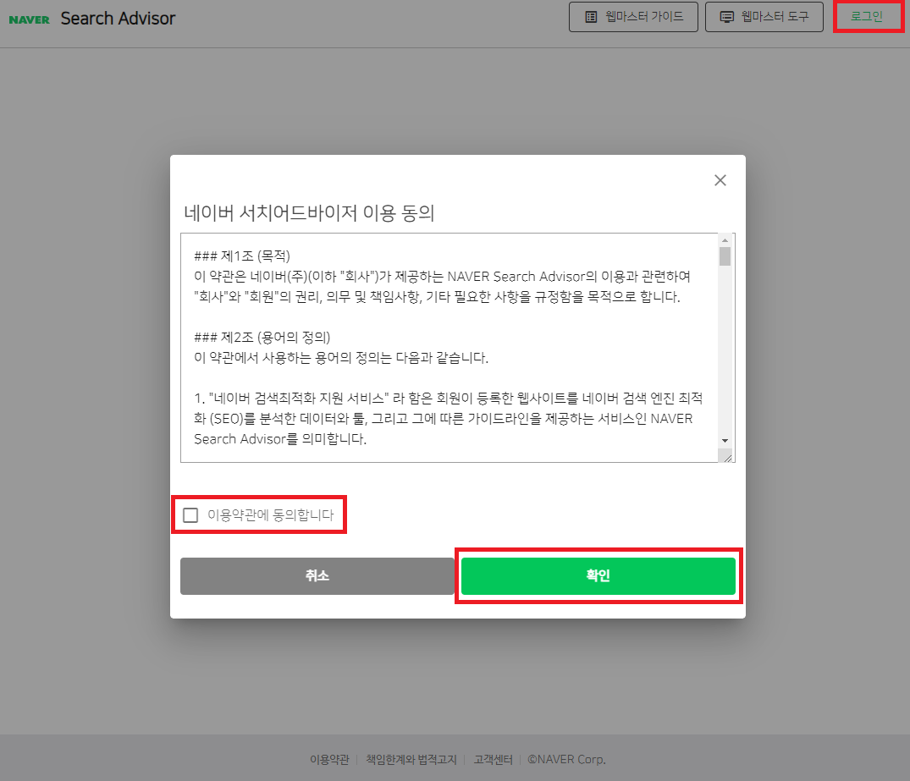  
>  동의 후 로그인

### 웹마스터 도구 사용하기
메인 페이지에서 조금 스크롤을 내려보시면 웹마스터 도구 사용하기라는 버튼이 있어요. 우리가 한 번 사용해보자구요!

  
>  웹마스터 도구 사용하기 버튼 클릭

### 사이트 등록
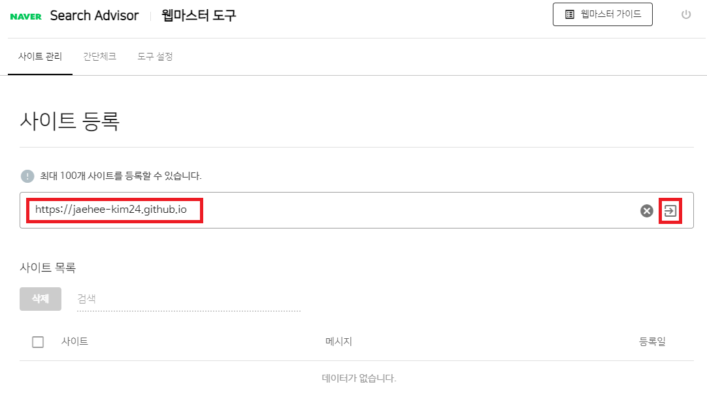  
>  우리의 블로그 주소 적고 시작!

### 소유권 확인
위에서 URL 입력하면 소유권 확인 절차를 거쳐야합니다. 구글 서치 콘솔에서 한 것 처럼 이번에도 HTML 태그를 사용해 소유 확인을 해볼게요.  

#### HTML 태그
HTML태그를 선택하고 content에 있는 내용을 복사할게요. 저는 0으로 시작해 7로 끝나는 저 문자열을 복사!

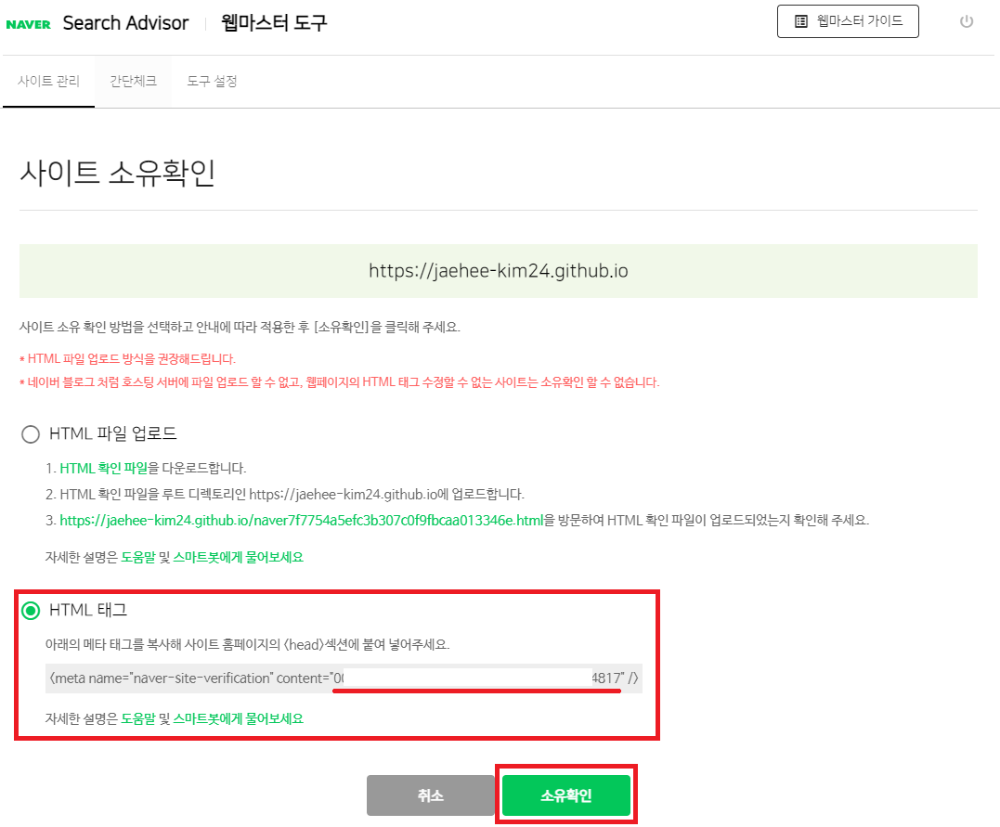   
> content 뒤 문자열 복사 

아직까지는 확인 버튼 누르면 안돼요!! 적용이 되지 않았기 때문에 에러가 날거에요. 아래 내용부터 따라해주세요.

#### _config.yml에 content 붙여넣기
복사한 내용을 보면 저 같은 경우  
`<meta name="naver-site-verification" content="0~~817" />`  
이렇게 나옵니다. `0~~817` 부분을 _config.yml에 붙여 넣을거에요. chirpy 기본에는 naver가 있지 않아서 추가해주고 content 값을 넣을게요.
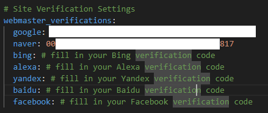    
> webmaster_verifications: 아래의 naver에 `0~~817` 붙여넣기

#### Commit & Push & Build & Deploy
이제 _config.yml 업데이트 된 부분을 배포 작업을 해야해요.  
지금까지 따라오신 분들은 커밋과 푸시, 빌드와 디플로이가 익숙하실텐데요. 혹시 못보신 분들은 [yml 파일 commit과 push](https://jaehee-kim24.github.io/posts/github%EB%B8%94%EB%A1%9C%EA%B7%B8_%EA%BE%B8%EB%AF%B8%EA%B8%B0/#yml-%ED%8C%8C%EC%9D%BC-commit%EA%B3%BC-push) 부분을 참고 해주세요.  

#### 배포 완료 후 확인
Github의 Action 탭에서 배포를 확인 한 후, 이제 확인 버튼을 눌러볼게요. 이후 자동등록 방지 보안문자 입력까지 해주세요!
   
> 소유 확인 버튼 클릭

#### 메타태그 인식 실패
짜짠~ 소유 확인이 완료 되었습니다!라고 뜰 줄 알았는데 실패..😭  

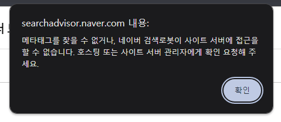   

개발자 도구를 켜서 해당 메타 태그가 있는지 확인해보니 구글은 잘 들어가 있는데 네이버꺼는 없더라구요.  
참참! 개발자 도구는 크롬 등의 브라우저에서 F12를 누르면 확인 할 수 있습니다.  
안되시는 분들은 메타 태그는 `<head>` 안에 생기니 안을 한번 확인 해보세요.

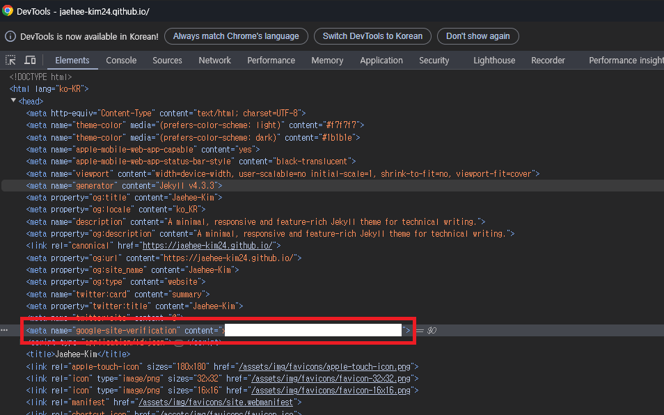   
> 구글 태그만 있고 네이버 태그는 없음   

찾아보니 SEO 플러그인이 아쉽지만 네이버 사이트 검증 메타태그를 지원하지 않는것 같더라구요. `_congfig.yml`의 webmaster_verifications 부분에 이미 작성되어있는 google, bing, alexa, yandex, baidu, facebook만 지원하고 있더라구요. ~~(네이버 분발해!!)~~  

#### head.html에 `<meta>` 붙여넣기
그래서 저는 직접 `<head>` 태그 안에 넣어보려고 합니다.
우리의 Chirpy 테마에서는 `<head>`를 `/_includes/head.html`에서 관리하고 있더군요. 여기 직접 넣어볼게요.

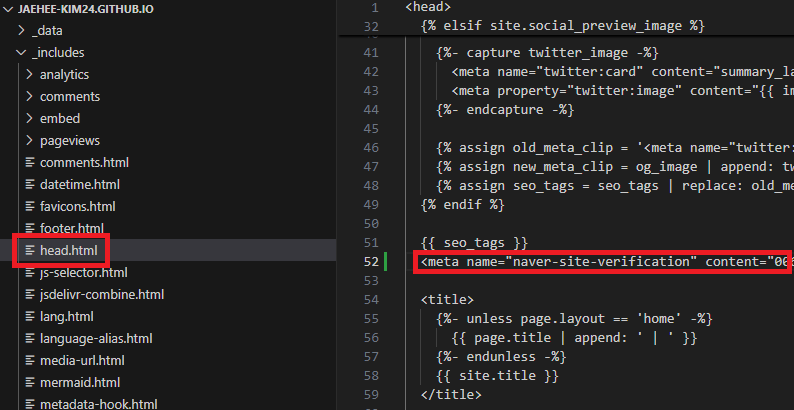   
> 메타 태그 직접 입력   

위치는 크게 중요하지 않아요. 그치만 저는 seo_tag 밑에 적어주었습니다.  

여기까지 했다면 이제 다시 배포하고 확인해볼게요. 앞에서 했던 과정 한 번 더 해주시면 됩니다.  
저는 올릴때 `_config.yml`에 적어두었던 naver 부분은 삭제하고 같이 올리려구요. 어차피 안되는데 모...👉👈

#### 배포 완료 후 확인
배포가 다 됐으면 우리 블로그에서 다시 개발자 도구를 켜서 우리가 직접 넣은 meta tag가 잘 들어갔나 확인해볼게요.

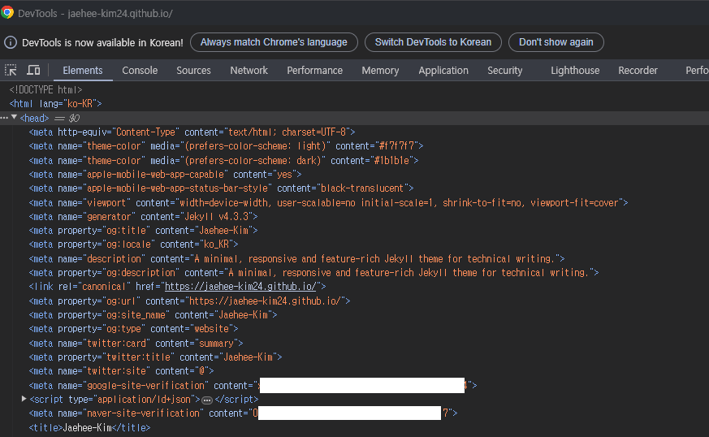   
> 메타 태그 적용 완료

처음부터 이 과정을 알려주지!! _config.yml에 해보는걸 왜 적어서 헷갈리게 하냐!!고 따지신다면 정말 죄송합니다😂  
제가 실패했던 과정을 남기고, 왜 그렇게 했었는지 기억하고 같은 실수를 하지 않기 위해서임으로, 너그러이 넘겨주세요.  
(SEO 플러그인을 잘 모르고 대충 되겠거니 하면서 진행한 나... 반성해🙇‍♀️)

### 성공 화면
오예! 드디어 성공

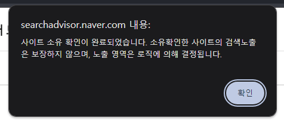   
> 소유권 확인 완료

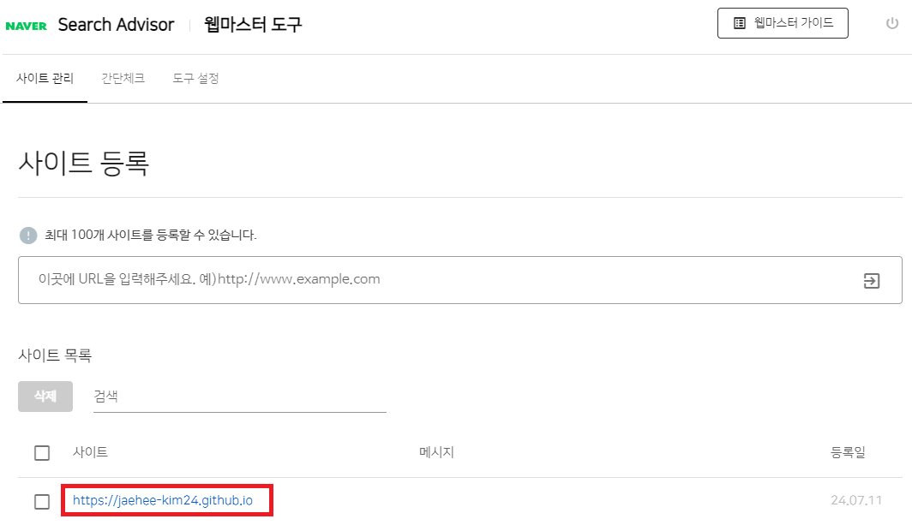   
> 사이트 등록 완료  

위 빨간 네모 링크를 클릭해서 확인해보세요.

## 2. 사이트맵 제출하기

앞서 구글에서 했던것처럼 네이버에도 사이트맵을 제출해볼게요.  
사이트 맵 주소는 여러분의 블로그 주소/sitemap.xml입니다.  
제 경우엔 `https://jaehee-kim24.github.io/sitemap.xml`을 제출할게요.

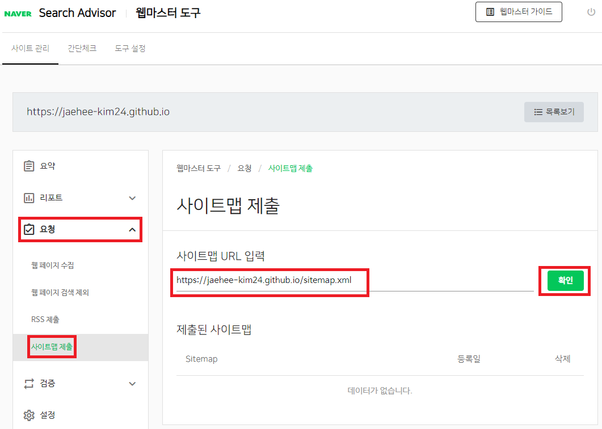   
> 요청 탭 -> 사이트맵 제출 -> url 작성 -> 확인

그럼 아래와 같이 제출 확인이 가능합니다.

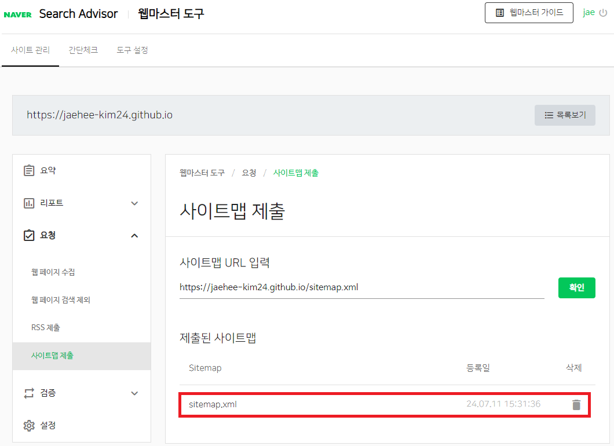   
 
## 3. 결과 확인
그럼 이제 내 블로그가 naver에 검색이 되겠지? 희희😁

### Naver에 검색

하지만 아쉽게도...여전히 아무것도 나오지 않네요😂  
보통 며칠이 걸리는 일이라고 하니 며칠 뒤 다시 올게요. 그리고 뒷 내용을 마저 작성하겠습니다.(현재 날짜 2024.07.11)

그럼 우선 안뇽 뿅!